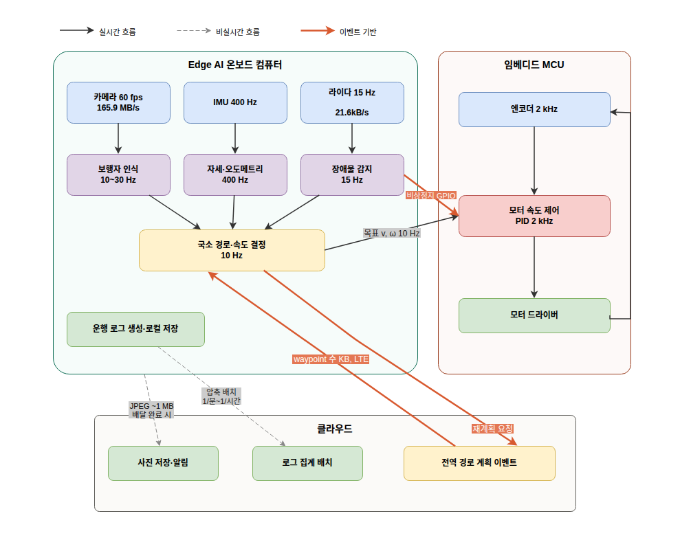
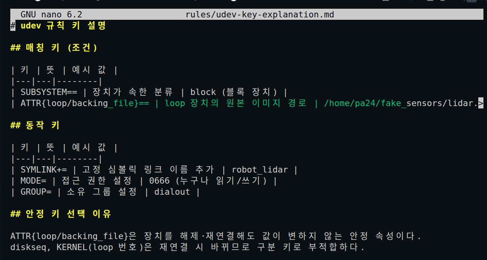
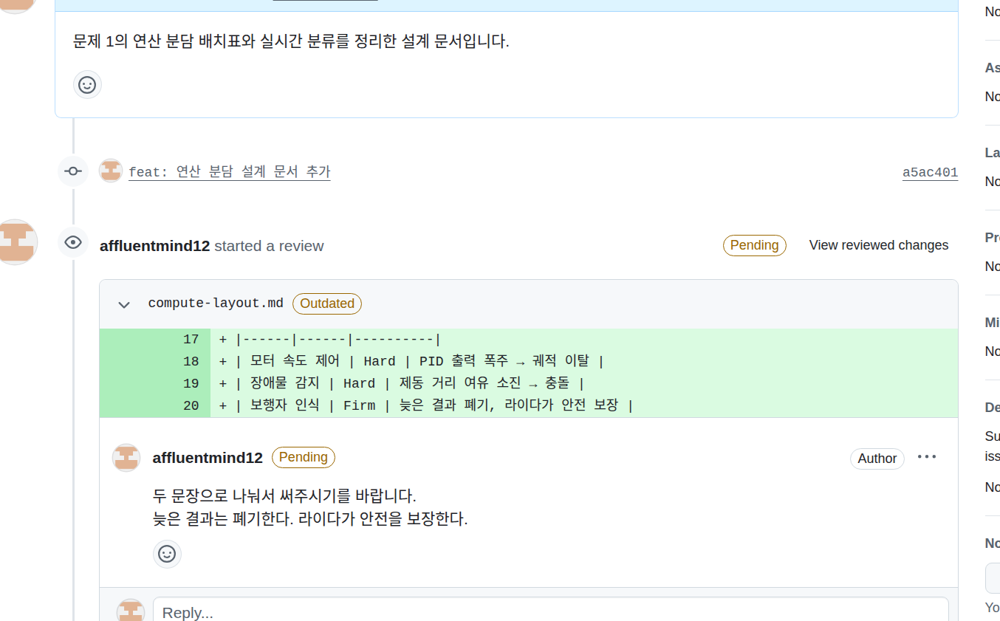
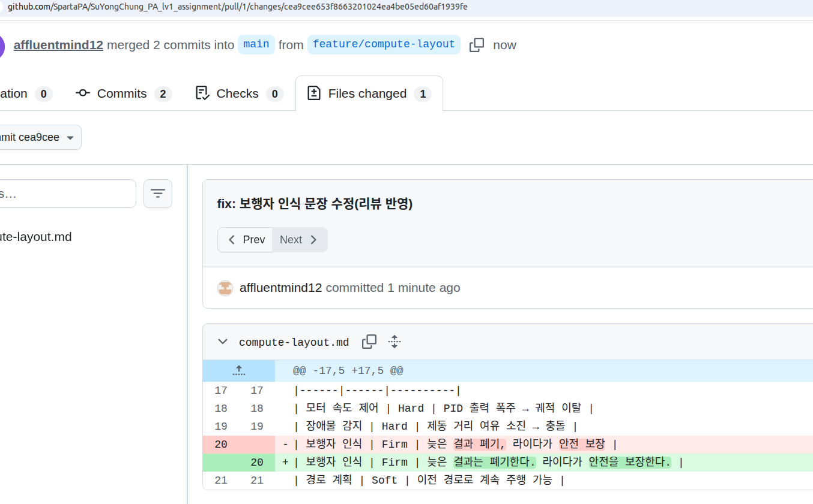
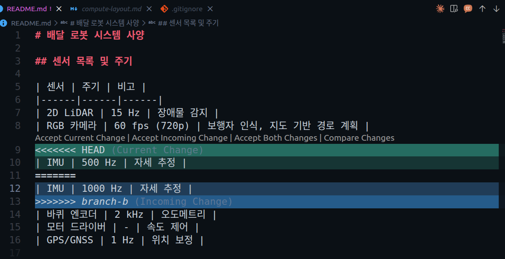
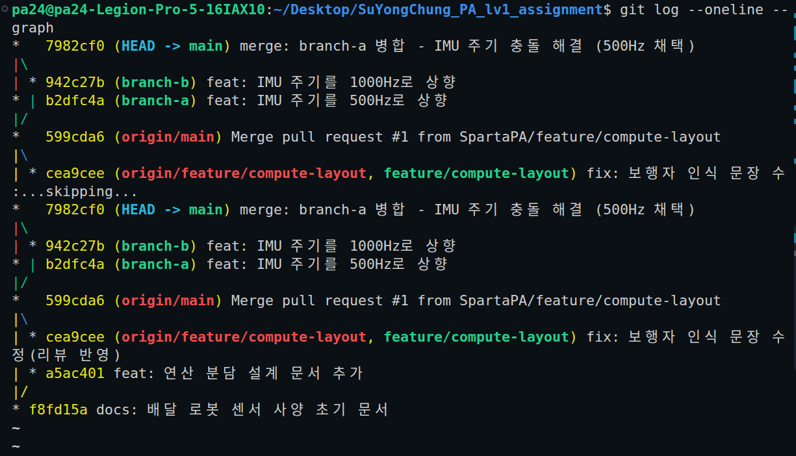
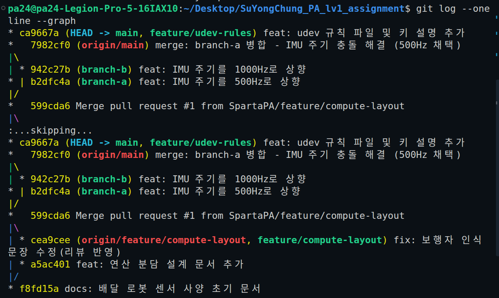

# 모듈 ① 과제 — 배달 로봇 온보딩

> 작성자: **정수용**  
> 작성일: 2026-08-26

---

## 문제 1. 배달 로봇의 연산 분담과 실시간성 설계


>전제: 배달 로봇의 주행 속도는 보도 주행 규정에 맞춰 **v = 1.5 m/s**, 감속도 **a = 2 m/s²** 로 가정합니다. 이 값으로 제동 거리는 v²/2a = 0.56 m 이고, 100 ms 반응 지연마다 0.15 m 씩 더 진행합니다.
### 1-1. 연산 분담 배치표

| 작업             | 처리 위치                                       | 지연 요구                     | 데이터량                                                                | 근거                                                                                                                                                                                                                                                                                               |
| -------------- | ------------------------------------------- | ------------------------- | ------------------------------------------------------------------- | ------------------------------------------------------------------------------------------------------------------------------------------------------------------------------------------------------------------------------------------------------------------------------------------------ |
| 모터 속도 제어       | **임베디드**(모터 드라이버 MCU)                       | ≤ 0.5ms(엔코더 2kHz 루프)      | 엔코더(4륜 기준) 2000Hz x 4B x 4바퀴 = 32 kB/s + 모터 명령 수 B/ms - 전부 보드 내부 통신 | 모터 제어 마감은 0.5ms 인데 반해 LTE 왕복 시간은 15ms이다.마감의 30배를 초과해서 네트워크를 거쳐갈 수 없고 Edge 컴퓨터의 범용 OS(리눅스 기준)는 모든 프로세스에 공평하게 CPU 시간을 나눠주는 것이 목표이므로 모터 제어 루프가 정확히 0.5ms마다 CPU를 받는다고 보장할 수 없다. 그리고 주기가 일정하지 않으면 지터가 커져 모터가 불안정해진다. 따라서 MCU의 타이머 인터럽트에서 PID를 돌린다.                                                    |
| 장애물 감지(2D 라이다) | **Edge AI**(온보드 컴퓨터) - 비상정지<br>신호는 임베디드로 처리 | ≤ 66.7 ms(스캔주기 1회 안에 판정)  | 라이다 1스캔 ≈ 360점 x 4B = 1,440B, 15Hz → **21.6kB/s** - 보드 내부 처리        | 클라우드에 두었을 때 스캔 하나를 놓칠시 LTE 왕복(RTT) 15ms 이상이 추가되어 그 사이 약 2.25cm를 추가로 이동한다. 스캔 주기가 66.7ms로 짧아졌으므로 클라우드 왕복을 포함하면 주기 안에 판정을 마치기 어렵다. Edge AI는 스캔주기 안에 판정될 수 있고 지도와 경로를 결합하기 위해서 Edge AI에서 처리하는 것이 맞다. 다만, '정지 거리 안에 장애물이 있다' 라고 판정하면 GPIO 핀으로 MCU에 직접 전달해서 Edge가 다운되더라도 MCU가 독립적으로 모터를 멈출 수 있게 해야한다. |
| 보행자 인식(카메라)    | **Edge AI**(GPU 탑재 온보드)                     | ≤ 50ms<br>(1~3 프레임 안에 결정) | 원시 165.9MB/s - 절대 밖으로 내보내지 않음                                       | 원시 영상 165.9MB/s(≈ 1,327Mbps)는 LTE 업로드(최대 100Mbps)의 약 13.3배라 클라우드로 전송 자체가 불가능하고 가능하더라도 LTE RTT가 추가되어 지연 예산을 초과한다. Edge AI의 온보드 GPU에서 경량 검출 모델을 돌리고(15~25ms) 결과(바운딩 박스 좌표 수십 Byte)만 판단 계층으로 넘긴다.                                                                                                   |
| 지도 기반 경로 계획    | **클라우드**(전역 경로) + Edge(국소 재계획)              | ≤ 1~5 s(출발·경로 재계획 시에만 시행) | 요청 수백 Byte, 응답 waypoint 수 KB - LTE로 충분                              | 경로 계획의 마감은 1~5초인데 LTE 왕복은 15ms이므로 지연 예산안에 들어온다. 지도 DB는 수 GB이고 도로 통제 및 다른 로봇 위치와 함께 갱신되므로 클라우드 서버에 두는 것이 합당하다. 응답이 몇 초 늦어도 이전 경로로 계속 주행할 수 있어 지연에 둔감하다. 다만 LTE가 끊길 수 있으므로 받은 경로를 Edge에 캐시해두고 주행 중 장애물이 나타나면 Edge가 스스로 회피할 수 있게 15Hz로 돌린다.                                                         |
| 배달 완료 사진 업로드   | **클라우드**                                    | ≤ n초 ~n 분(비실시간, 재전송 허용)   | JPEG 1장 ≈ 0.5~2MB, 배달 1건당 1회                                        | 실시간성이 없고 사진 업로드가 몇 분 늦어도 안전 문제가 아니라 서비스 불편 수준이다. 데이터도 JPEG 1장(약 2MB)이라 LTE 100Mbps(≈12.5MB/s)로 0.16초면 전송 가능하다. 통신 불량 시에는 큐에 넣고 나중에 재전송 하면 된다.                                                                                                                                                    |
| 운행 로그 집계       | **클라우드**                                    | ≤ n분 ~ n시간(배치)            | 원시 로그 수십KB/s를 로컬에 저장하고 압축 후 배치 업로드, 수십 MB/일                         | 운행 로그 집계에는 마감이 없고 실시간 스트리밍은 매초 수십 KB씩 계속 LTE를 사용하므로 대역폭과 요금만 낭비하므로 로컬에 모아뒀다가 Wi-Fi가 잡히거나 유휴 시간에 한 번에 전송한다.                                                                                                                                                                                       |

---

### 1-2. 카메라 원시 영상 전송량

- 계산 과정:  
  `프레임 1장(Full HD 기준) = 1280 x 720 픽셀 x 3 B(RGB는 8 bit) = 2,764,800 B ≈ 2.76 MB `
   
   `초당 전송량(60 fps 기준) = 2,764,800 B x 60 fps = 165,888,000 B/s ≈ 165.9 MB/s`

- 전송량: **165.9 MB/s**
- LTE 대비 판단: **성립하지 않는다.** `LTE 업/다운로드 최대 100Mbps 기준으로 165.9 MB/s를 Mbps로 환산하면 165.9 × 8 = 1,327.1Mbps이다. 카메라 원시 영상 전송량이 LTE 업로드 100Mbps 대비 약 13.3배 초과하므로 원시 영상의 실시간 전송은 성립하지 않는다.`
---

### 1-3. 인지·판단·제어 계층 매핑과 주기표

| 작업             | 계층           | 갱신 주기                      | 실행 위치             | 입력 -> 출력                             |
| -------------- | ------------ | -------------------------- | ----------------- | ------------------------------------ |
| 엔코더 읽기         | 인지           | 2 kHz                      | 임베디드              | 펄스 카운트 -> 바퀴 각속도                     |
| IMU 읽기 · 자세 융합 | 인지           | 400 Hz                     | 임베디드/Edge         | 가속도 · 각속도 -> 자세 · 오도메트리              |
| 장애물 감지         | 인지           | 15 Hz                      | Edge( +MCU 비상 정지) | 라이다 스캔 -> 장애물 점군 · 최근접 거리            |
| 보행자 인식         | 인지           | 60Hz 입력 -> 10~30Hz 출력      | Edge(GPU)         | 카메라 프레임-> 보행자 바운딩 박스 · 거리            |
| 지도 기반 전역 경로 계획 | 판단           | 이벤트(출발 · 재계획) ≈ 0.1 ~ 1 Hz | 클라우드              | 출발 · 목적지 · 지도 -> waypoint 열          |
| 국소 경로 · 속도 결정  | 판단           | 10 Hz                      | Edge              | waypoint + 장애물 + 보행자 -> 목표 선속도 · 각속도 |
| 모터 속도 제어(PID)  | 제어           | 2 kHz                      | 임베디드              | 목표 속도 vs 엔코도 -> PWM 듀티               |
| (비실시간)         | 배달 완료 사진 업로드 | 이벤트(배달 완료 시)               | 클라우드              | JPEG -> 저장 · 알림                      |
| (비실시간)         | 운행 로그 집계     | 배치 1/N분 ~ 1/N시간            | 클라우드              | 로그 파일 -> 통계 · 대시보드                   |
- 멀티레이트 데이터 흐름표



| 선 스타일 | 의미      | 해당 연결                             |
| ----- | ------- | --------------------------------- |
| 검은 실선 | 실시간 흐름  | 센서 -> 인지 -> 판단 -> 제어, 엔코더 피드백     |
| 회색 점선 | 비실시간 흐름 | 사진 업로드, 로그 배치 전송                  |
| 주황 실선 | 이벤트 기반  | 비상정지 GPIO, 전역 경로 waypoint, 재계획 요청 |
- 모터 드라이버와 엔코더를 실선으로 연결하여 **피드백 루프(폐루프)** 형태로 표시하였습니다.

---

### 1-4. Hard / Firm / Soft 실시간 분류표

| 작업            | 실시간 등급 | 마감 (ms)        | 마감 초과 시 결과                                                                              | 분류 근거                                                               |
| ------------- | ------ | -------------- | --------------------------------------------------------------------------------------- | ------------------------------------------------------------------- |
| 모터 속도 제어      | Hard   | 0.5 ms         | PID의 dt가 틀어져 적분·미분 출력이 튀고 연속으로 놓치면 바퀴 속도가 통제 불능이 되어 궤적 이탈이나 미끄러짐이 발생한다.                 | 한 번의 초과로 물리적 사고로 직결된다. 늦은 결과의 가치는 0(Hard 등급)이 아니라 음수이므로 치명적 실패가 된다. |
| 장애물 감지(비상 정지) | Hard   | 66.7ms(스캔 1회)  | 스캔 하나를 놓칠 때마다 0.1m씩 더 진행하고 두 번 놓치면 제동 거리 여유(0.56m)가 사라져 대상과 충돌한다.                       | 안전 기능이므로 마감 초과 시 충돌 확률이 증가한다.                                       |
| 보행자 인식        | Firm   | 50 ms(≈ 3 프레임) | 늦게 나온 바운딩박스는 보행자가 이미 이동한 뒤라 폐기하고 다음 프레임을 처리한다. 가끔 놓쳐도 라이다 비상정지가 안전을 보장하므로 사고로 직결되지 않는다. | 늦은 결과의 가치는 0(Firm 등급 -> 버림)지만 놓쳐도 시스템 실패는 아니다.                      |
| 지도 기반 경로 계획   | Soft   | 1 ~ 5 s        | 응답이 늦으면 로봇은 이전 경로로 계속 주행하거나 잠시 대기한다. 늦어질수록 배달 시간이 늘지만 늦은 경로도 여전히 쓸 수 있다.                | 늦은 결과도 가치가 점진적으로 감소할 뿐 0이 아니다.(Soft 등급)                             |
| 배달 완료 사진 업로드  | Soft   | 수 분            | 고객 알림이 늦어질 뿐 안전과는 무관하고 재전송하면 된다.                                                        | 마감 자체가 여유롭고 재시도가 가능하다.                                              |
| 운행 로그 집계      | Soft   | 시간 단위          | 대시보드가 늦게 갱신될 뿐이다.                                                                       | 배치 작업이므로 마감이 없는 것에 가깝다.                                             |
-  Hard 항목의 마감 초과 결과
  - 모터 속도 제어: 1ms 마감을 놓치면 PID 출력이 튀어서 바퀴 속도가 통제 불능이 되어 궤적을 이탈하거나 미끄러짐 현상이 발생할 수 있다.
  - 장애물 감지: 스캔 하나를 놓칠 때마다 0.15m씩 더 진행하고 제동 거리 여유가 사라져 대상과 충돌한다.
  ---

### 1-5. 주기 · 지연 · 지터 구분

- **주기(Period)**: `같은 작업이 반복 실행되는 시간 간격. 예) 모터 제어가 0.5ms마다 반복 -> 주기 0.5ms(=2kHz)`
- **지연(Latency)**: `입력(센서 읽기)이 들어와서 출력(모터 명령)이 나올 때까지 걸리는 한 번의 처리 시간. 예) LiDAR 스캔 -> 장애물 판정 -> 정지 명령까지 30 ~ 50ms`
- **지터(Jitter)**: `주기(또는 지연)가 매번 얼마나 들쭉날쭉한지의 편차이다. 평균 주기가 정확해도 지터가 크면 PID 제어의 전제(일정한 Δt)가 깨져 제어가 불안정해진다. 예)모터 속도 제어(2kHz)를 리눅스에서 돌리면 OS 스케줄링 때문에 실제 dt가 0.35~0.65ms로 튀어 PID 계산이 매번 틀어지므로 MCU 타이머 인터럽트로 돌려 지터를 억제해야한다.`

---

## 문제 2. 원격 접속(SSH)과 센서 장치 경로 고정

### 2-1. 고른 접속 대상

- 접속 대상: `localhost / 가상머신 중 ` **localhost** 
- 터미널 창에 **ssh $USER@localhost** 입력한다.
    - ```
      ~$ ssh $USER@localhost
      Welcome to Ubuntu 22.04.5 LTS (GNU/Linux 6.8.0-138-generic x86_64)
       * Documentation:  https://help.ubuntu.com
       * Management:     https://landscape.canonical.com
       * Support:        https://ubuntu.com/pro

      Expanded Security Maintenance for Applications is not enabled.

      183 updates can be applied immediately.
      To see these additional updates run: apt list --upgradable

      144 additional security updates can be applied with ESM Apps.
      Learn more about enabling ESM Apps service at https://ubuntu.com/esm

      Last login: Mon Aug 31 14:15:37 2026 from 127.0.0.1

      ```


-  터미널 창에 **sudo apt install openssh-server** 입력
    -  ```
      [sudo] pa24 암호: 
패키지 목록을 읽는 중입니다... 완료
의존성 트리를 만드는 중입니다... 완료
상태 정보를 읽는 중입니다... 완료        
패키지 openssh-server는 이미 최신 버전입니다 (1:8.9p1-3ubuntu0.17).
다음 패키지가 자동으로 설치되었지만 더 이상 필요하지 않습니다:
  libfwupd2 libfwupdplugin5 libgcab-1.0-0 libsmbios-c2
'sudo apt autoremove'를 이용하여 제거하십시오.
0개 업그레이드, 0개 새로 설치, 0개 제거 및 188개 업그레이드 안 함.
      ```
-  터미널 창에 **systemctl status ssh** 입력
    -  ```
       ssh.service - OpenBSD Secure Shell server
     Loaded: loaded (/lib/systemd/system/ssh.service; enabled; vendor preset: enabled)
     Active: active (running) since Sat 2026-09-05 14:26:41 KST; 1 day 8h ago
       Docs: man:sshd(8)
             man:sshd_config(5)
   Main PID: 216115 (sshd)
      Tasks: 1 (limit: 37548)
     Memory: 4.4M
        CPU: 27ms
     CGroup: /system.slice/ssh.service
             └─216115 "sshd: /usr/sbin/sshd -D [listener] 0 of 10-100 startups"

       Sep 05 14:26:41 pa24-Legion-Pro-5-16IAX10 systemd[1]: Starting OpenBSD Secure Shell server...
Sep 05 14:26:41 pa24-Legion-Pro-5-16IAX10 sshd[216115]: Server listening on 0.0.0.0 port 22.
Sep 05 14:26:41 pa24-Legion-Pro-5-16IAX10 sshd[216115]: Server listening on :: port 22.
Sep 05 14:26:41 pa24-Legion-Pro-5-16IAX10 systemd[1]: Started OpenBSD Secure Shell server.
Sep 06 22:54:24 pa24-Legion-Pro-5-16IAX10 sshd[286993]: Accepted publickey for pa24 from 127.0.0.1 port 49232 ssh2: ED25519 >
Sep 06 22:54:24 pa24-Legion-Pro-5-16IAX10 sshd[286993]: pam_unix(sshd:session): session opened for user pa24(uid=1000) by (u>
lines 1-18/18 (END)


      ``` 
-  터미널 창에 **ss -tlnp | grep :22** 입력
    -  ```
      LISTEN 0      128          0.0.0.0:22         0.0.0.0:*                                       
LISTEN 0      128             [::]:22            [::]:*
      ```
-  터미널 창에 **ssh-keygen -t ed25519** 입력
    -  ```
      $ ssh-keygen -t ed25519
Generating public/private ed25519 key pair.
Enter file in which to save the key (/home/pa24/.ssh/id_ed25519): 
/home/pa24/.ssh/id_ed25519 already exists.
Overwrite (y/n)? n
      ```
-  터미널 창에 **ssh-copy-id $USER@localhost** 입력
    -  ```
      ssh-copy-id $USER@localhost
/usr/bin/ssh-copy-id: INFO: Source of key(s) to be installed: "/home/pa24/.ssh/id_ed25519.pub"
/usr/bin/ssh-copy-id: INFO: attempting to log in with the new key(s), to filter out any that are already installed
/usr/bin/ssh-copy-id: WARNING: All keys were skipped because they already exist on the remote system.
		(if you think this is a mistake, you may want to use -f option)
      ```
  > **$USER**는 리눅스가 자동으로 사용자 이름을 바꿔주는 환경 변수
- **`who` 출력:**
  ```
  pa24     :0           2026-08-30 22:05 (:0)
  pa24     pts/3        2026-09-06 22:54 (127.0.0.1)
  ```


- **`echo $SSH_CONNECTION` 출력:**
    ```
    127.0.0.1 49232 127.0.0.1 22
    ```
  

---

### 2-2. **개인키·공개키 중 서버에 등록하는 것**

- 개인키·공개키 중 서버에 등록하는 것: **공개키**
- 안전한 이유: 공개키는 자물쇠 역할(잠그기만 가능)이라 유출되어도 열 수 없고 열쇠인 개인키는 내 PC 밖으로 나가지 않으므로 서버가 해킹되어도 접속이 불가능하다.

> 💡 터미널에 cat ~/.ssh/authorized_keys 입력하면 authorized_keys에 뭐가 들어갔는지 확인할 수 있다.

---

### 2-3. 원격 단일 명령 실행과 scp 전송
- **원격 단일 명령 실행 출력:** 
  - 먼저 터미널창에서 exit으로 SSH 세션에서 나간다.
  - **ssh $USER@localhost 'uname -a'** 명령어를 터미널에 입력하여 원격으로 단일 명령 실행한다.
    - `Linux pa24-Legion-Pro-5-16IAX10 6.8.0-138-generic #138~22.04.1-Ubuntu SMP PREEMPT_DYNAMIC Fri Aug  7 13:43:15 UTC  x86_64 x86_64 x86_64 GNU/Linux`

 - **scp 전송 출력:**
   -  임의로 test_sensor.txt라는 테스트 파일을 만들어서 전송하고 전송 확인을 한다.
   -  echo "sensor test data" > ~/test_sensor.txt
   -  scp ~/test_sensor.txt $USER@localhost:~/received_sensor.txt
        - `test_sensor.txt                                                                     100%   17    16.4KB/s   00:00` 가 출력된다. 
    
    -  ssh $USER@localhost 'cat ~/received_sensor.txt'
       - `sensor   test   data`가 출력된다.
  

---
### 2-4-0. 라이다·IMU loop 장치 2개 붙이기 - USB 하드웨어 없이 진행
-  터미널 창에 아래 명령어를 입력한다. 
  - mkdir -p ~/fake_sensors && cd ~/fake_sensors
  -  truncate -s 16M lidar.img
  -  truncate  -s 24M imu.img
  -  sudo losetup -f --show lidar.img
     - `/dev/loop6`  가 출력된다.
  -  sudo losetup -f --show imu.img
     - `/dev/loop22` 가 출력된다.

### 2-4-1. ls -l /dev/tty* 로 시리얼 장치 파일 확인
- 터미널 창에 ls -l /dev/tty* 명령어 입력하면 아래와 같이 나온다.
    -  ```
      ~/fake_sensors$ ls -l /dev/tty*
crw-rw-rw- 1 root tty     5,  0 Sep  6 23:21 /dev/tty
crw--w---- 1 root tty     4,  0 Aug 30 22:05 /dev/tty0
crw--w---- 1 root tty     4,  1 Aug 30 22:05 /dev/tty1
crw--w---- 1 root tty     4, 10 Aug 30 22:05 /dev/tty10
crw--w---- 1 root tty     4, 11 Aug 30 22:05 /dev/tty11
crw--w---- 1 root tty     4, 12 Aug 30 22:05 /dev/tty12
crw--w---- 1 root tty     4, 13 Aug 30 22:05 /dev/tty13
crw--w---- 1 root tty     4, 14 Aug 30 22:05 /dev/tty14
crw--w---- 1 root tty     4, 15 Aug 30 22:05 /dev/tty15
crw--w---- 1 root tty     4, 16 Aug 30 22:05 /dev/tty16
crw--w---- 1 root tty     4, 17 Aug 30 22:05 /dev/tty17
crw--w---- 1 root tty     4, 18 Aug 30 22:05 /dev/tty18
crw--w---- 1 root tty     4, 19 Aug 30 22:05 /dev/tty19
crw--w---- 1 pa24 tty     4,  2 Aug 30 22:05 /dev/tty2
crw--w---- 1 root tty     4, 20 Aug 30 22:05 /dev/tty20
crw--w---- 1 root tty     4, 21 Aug 30 22:05 /dev/tty21
crw--w---- 1 root tty     4, 22 Aug 30 22:05 /dev/tty22
crw--w---- 1 root tty     4, 23 Aug 30 22:05 /dev/tty23
crw--w---- 1 root tty     4, 24 Aug 30 22:05 /dev/tty24
crw--w---- 1 root tty     4, 25 Aug 30 22:05 /dev/tty25
crw--w---- 1 root tty     4, 26 Aug 30 22:05 /dev/tty26
crw--w---- 1 root tty     4, 27 Aug 30 22:05 /dev/tty27
crw--w---- 1 root tty     4, 28 Aug 30 22:05 /dev/tty28
crw--w---- 1 root tty     4, 29 Aug 30 22:05 /dev/tty29
crw--w---- 1 root tty     4,  3 Aug 30 22:05 /dev/tty3
crw--w---- 1 root tty     4, 30 Aug 30 22:05 /dev/tty30
crw--w---- 1 root tty     4, 31 Aug 30 22:05 /dev/tty31
crw--w---- 1 root tty     4, 32 Aug 30 22:05 /dev/tty32
crw--w---- 1 root tty     4, 33 Aug 30 22:05 /dev/tty33
crw--w---- 1 root tty     4, 34 Aug 30 22:05 /dev/tty34
crw--w---- 1 root tty     4, 35 Aug 30 22:05 /dev/tty35
crw--w---- 1 root tty     4, 36 Aug 30 22:05 /dev/tty36
crw--w---- 1 root tty     4, 37 Aug 30 22:05 /dev/tty37
crw--w---- 1 root tty     4, 38 Aug 30 22:05 /dev/tty38
crw--w---- 1 root tty     4, 39 Aug 30 22:05 /dev/tty39
crw--w---- 1 root tty     4,  4 Aug 30 22:05 /dev/tty4
crw--w---- 1 root tty     4, 40 Aug 30 22:05 /dev/tty40
crw--w---- 1 root tty     4, 41 Aug 30 22:05 /dev/tty41
crw--w---- 1 root tty     4, 42 Aug 30 22:05 /dev/tty42
crw--w---- 1 root tty     4, 43 Aug 30 22:05 /dev/tty43
crw--w---- 1 root tty     4, 44 Aug 30 22:05 /dev/tty44
crw--w---- 1 root tty     4, 45 Aug 30 22:05 /dev/tty45
crw--w---- 1 root tty     4, 46 Aug 30 22:05 /dev/tty46
crw--w---- 1 root tty     4, 47 Aug 30 22:05 /dev/tty47
crw--w---- 1 root tty     4, 48 Aug 30 22:05 /dev/tty48
crw--w---- 1 root tty     4, 49 Aug 30 22:05 /dev/tty49
crw--w---- 1 root tty     4,  5 Aug 30 22:05 /dev/tty5
crw--w---- 1 root tty     4, 50 Aug 30 22:05 /dev/tty50
crw--w---- 1 root tty     4, 51 Aug 30 22:05 /dev/tty51
crw--w---- 1 root tty     4, 52 Aug 30 22:05 /dev/tty52
crw--w---- 1 root tty     4, 53 Aug 30 22:05 /dev/tty53
crw--w---- 1 root tty     4, 54 Aug 30 22:05 /dev/tty54
crw--w---- 1 root tty     4, 55 Aug 30 22:05 /dev/tty55
crw--w---- 1 root tty     4, 56 Aug 30 22:05 /dev/tty56
crw--w---- 1 root tty     4, 57 Aug 30 22:05 /dev/tty57
crw--w---- 1 root tty     4, 58 Aug 30 22:05 /dev/tty58
crw--w---- 1 root tty     4, 59 Aug 30 22:05 /dev/tty59
crw--w---- 1 root tty     4,  6 Aug 30 22:05 /dev/tty6
crw--w---- 1 root tty     4, 60 Aug 30 22:05 /dev/tty60
crw--w---- 1 root tty     4, 61 Aug 30 22:05 /dev/tty61
crw--w---- 1 root tty     4, 62 Aug 30 22:05 /dev/tty62
crw--w---- 1 root tty     4, 63 Aug 30 22:57 /dev/tty63
crw--w---- 1 root tty     4,  7 Aug 30 22:05 /dev/tty7
crw--w---- 1 root tty     4,  8 Aug 30 22:05 /dev/tty8
crw--w---- 1 root tty     4,  9 Aug 30 22:05 /dev/tty9
crw------- 1 root root    5,  3 Aug 30 22:05 /dev/ttyprintk
crw-rw---- 1 root dialout 4, 64 Aug 30 22:05 /dev/ttyS0
crw-rw---- 1 root dialout 4, 65 Aug 30 22:05 /dev/ttyS1
crw-rw---- 1 root dialout 4, 74 Aug 30 22:05 /dev/ttyS10
crw-rw---- 1 root dialout 4, 75 Aug 30 22:05 /dev/ttyS11
crw-rw---- 1 root dialout 4, 76 Aug 30 22:05 /dev/ttyS12
crw-rw---- 1 root dialout 4, 77 Aug 30 22:05 /dev/ttyS13
crw-rw---- 1 root dialout 4, 78 Aug 30 22:05 /dev/ttyS14
crw-rw---- 1 root dialout 4, 79 Aug 30 22:05 /dev/ttyS15
crw-rw---- 1 root dialout 4, 80 Aug 30 22:05 /dev/ttyS16
crw-rw---- 1 root dialout 4, 81 Aug 30 22:05 /dev/ttyS17
crw-rw---- 1 root dialout 4, 82 Aug 30 22:05 /dev/ttyS18
crw-rw---- 1 root dialout 4, 83 Aug 30 22:05 /dev/ttyS19
crw-rw---- 1 root dialout 4, 66 Aug 30 22:05 /dev/ttyS2
crw-rw---- 1 root dialout 4, 84 Aug 30 22:05 /dev/ttyS20
crw-rw---- 1 root dialout 4, 85 Aug 30 22:05 /dev/ttyS21
crw-rw---- 1 root dialout 4, 86 Aug 30 22:05 /dev/ttyS22
crw-rw---- 1 root dialout 4, 87 Aug 30 22:05 /dev/ttyS23
crw-rw---- 1 root dialout 4, 88 Aug 30 22:05 /dev/ttyS24
crw-rw---- 1 root dialout 4, 89 Aug 30 22:05 /dev/ttyS25
crw-rw---- 1 root dialout 4, 90 Aug 30 22:05 /dev/ttyS26
crw-rw---- 1 root dialout 4, 91 Aug 30 22:05 /dev/ttyS27
crw-rw---- 1 root dialout 4, 92 Aug 30 22:05 /dev/ttyS28
crw-rw---- 1 root dialout 4, 93 Aug 30 22:05 /dev/ttyS29
crw-rw---- 1 root dialout 4, 67 Aug 30 22:05 /dev/ttyS3
crw-rw---- 1 root dialout 4, 94 Aug 30 22:05 /dev/ttyS30
crw-rw---- 1 root dialout 4, 95 Aug 30 22:05 /dev/ttyS31
crw-rw---- 1 root dialout 4, 68 Aug 30 22:05 /dev/ttyS4
crw-rw---- 1 root dialout 4, 69 Aug 30 22:05 /dev/ttyS5
crw-rw---- 1 root dialout 4, 70 Aug 30 22:05 /dev/ttyS6
crw-rw---- 1 root dialout 4, 71 Aug 30 22:05 /dev/ttyS7
crw-rw---- 1 root dialout 4, 72 Aug 30 22:05 /dev/ttyS8
crw-rw---- 1 root dialout 4, 73 Aug 30 22:05 /dev/ttyS9

      ```


| ==관찰 포인트==        | ==출력에서 보이는 것==                 | ==의미==                               |
| ----------------- | ------------------------------ | ------------------------------------ |
| 맨 앞 글자 **c**      | **crw-rw-rw-**, **crw--w----** | **문자 장치(character device)**          |
| 그룹                | **tty**                        | tty 장치 그룹(USB 시리얼이면 **dialout**이 보임) |
| **/dev/tty2** 소유자 | **pa24**                       | 사용자가 로컬 로그인한 터미널                     |

### 2-4-2. 두 장치를 구분한 속성

- 라이다: **ATTR{diskseq}== "49", ATTR{size}== "32768"**
- IMU: **ATTR{diskseq}== "51", ATTR{size}== "49152"**

- 터미널에서 2-4-0에서 만든 fake_sensors 폴더로 이동한 뒤 
  udevadm info --attribute-walk /dev/loop6
  udevadm info --attribute-walk /dev/loop22를 터미널 창에 치면 아래 사진과 같이 나온다. 
    -  ```
      ~/fake_sensors$ udevadm info --attribute-walk /dev/loop6

       Udevadm info starts with the device specified by the devpath and then
walks up the chain of parent devices. It prints for every device
found, all possible attributes in the udev rules key format.
A rule to match, can be composed by the attributes of the device
and the attributes from one single parent device.

      looking at device '/devices/virtual/block/loop6':
        KERNEL=="loop6"
        SUBSYSTEM=="block"
        DRIVER==""
        ATTR{alignment_offset}=="0"
        ATTR{capability}=="0"
        ATTR{discard_alignment}=="0"
        ATTR{diskseq}=="49"
        ATTR{events}=="media_change"
        ATTR{events_async}==""
        ATTR{events_poll_msecs}=="-1"
        ATTR{ext_range}=="256"
        ATTR{hidden}=="0"
        ATTR{inflight}=="       0        0"
        ATTR{integrity/device_is_integrity_capable}=="0"
        ATTR{integrity/format}=="none"
        TTR{integrity/protection_interval_bytes}=="0"
        ATTR{integrity/read_verify}=="0"
        ATTR{integrity/tag_size}=="0"
        ATTR{integrity/write_generate}=="0"
        ATTR{loop/autoclear}=="0"
        ATTR{loop/dio}=="0"
        ATTR{loop/offset}=="0"
        ATTR{loop/partscan}=="0"
        ATTR{loop/sizelimit}=="0"
        ATTR{mq/0/cpu_list}=="0, 1, 2, 3, 4, 5, 6, 7, 8, 9, 10, 11, 12, 13, 14, 15, 16, 17, 18, 19, 20, 21, 22, 23"
        ATTR{mq/0/nr_reserved_tags}=="0"
        ATTR{mq/0/nr_tags}=="128"
        ATTR{partscan}=="0"
        ATTR{power/async}=="disabled"
        ATTR{power/control}=="auto"
        ATTR{power/runtime_active_kids}=="0"
        ATTR{power/runtime_active_time}=="0"
        ATTR{power/runtime_enabled}=="disabled"
        ATTR{power/runtime_status}=="unsupported"
        ATTR{power/runtime_suspended_time}=="0"
        ATTR{power/runtime_usage}=="0"
        ATTR{queue/add_random}=="0"
        ATTR{queue/chunk_sectors}=="0"
        ATTR{queue/dax}=="0"
        ATTR{queue/discard_granularity}=="4096"
        ATTR{queue/discard_max_bytes}=="4294966784"
        ATTR{queue/discard_max_hw_bytes}=="4294966784"
        ATTR{queue/discard_zeroes_data}=="0"
        ATTR{queue/dma_alignment}=="511"
        ATTR{queue/fua}=="0"
        ATTR{queue/hw_sector_size}=="512"
        ATTR{queue/io_poll}=="0"
        ATTR{queue/io_poll_delay}=="-1"
        ATTR{queue/iostats}=="1"
        ATTR{queue/logical_block_size}=="512"
        ATTR{queue/max_discard_segments}=="1"
        ATTR{queue/max_hw_sectors_kb}=="1280"
        ATTR{queue/max_integrity_segments}=="0"
        ATTR{queue/max_sectors_kb}=="1280"
        ATTR{queue/max_segment_size}=="65536"
        ATTR{queue/max_segments}=="128"
        ATTR{queue/minimum_io_size}=="512"
        ATTR{queue/nomerges}=="0"
        ATTR{queue/nr_requests}=="128"
        ATTR{queue/nr_zones}=="0"
        ATTR{queue/optimal_io_size}=="0"
        ATTR{queue/physical_block_size}=="512"
        ATTR{queue/read_ahead_kb}=="128"
        ATTR{queue/rotational}=="0"
        ATTR{queue/rq_affinity}=="1"
        ATTR{queue/scheduler}=="[none] mq-deadline "
        ATTR{queue/stable_writes}=="0"
        ATTR{queue/virt_boundary_mask}=="0"
        ATTR{queue/wbt_lat_usec}=="75000"
        ATTR{queue/write_cache}=="write back"
        ATTR{queue/write_same_max_bytes}=="0"
        ATTR{queue/write_zeroes_max_bytes}=="4294966784"
        ATTR{queue/zone_append_max_bytes}=="0"
        ATTR{queue/zone_write_granularity}=="0"
        ATTR{queue/zoned}=="none"
        ATTR{range}=="1"
        ATTR{removable}=="0"
        ATTR{ro}=="0"
        ATTR{size}=="32768"
        ATTR{stat}=="     126        0     3536        4        0        0        0        0        0        6        4        0        0        0        0        0        0"
        ATTR{trace/act_mask}=="disabled"
        ATTR{trace/enable}=="0"
        ATTR{trace/end_lba}=="disabled"
        ATTR{trace/pid}=="disabled"
        ATTR{trace/start_lba}=="disabled"
      ```
    -  ```
      ~/fake_sensors$ udevadm info --attribute-walk /dev/loop22

      Udevadm info starts with the device specified by the devpath and then
      walks up the chain of parent devices. It prints for every device
      found, all possible attributes in the udev rules key format.
      A rule to match, can be composed by the attributes of the device
      and the attributes from one single parent device.

      looking at device '/devices/virtual/block/loop22':
      KERNEL=="loop22"
      SUBSYSTEM=="block"
      DRIVER==""
      ATTR{alignment_offset}=="0"
      ATTR{capability}=="0"
      ATTR{discard_alignment}=="0"
      ATTR{diskseq}=="51"
      ATTR{events}=="media_change"
      ATTR{events_async}==""
      ATTR{events_poll_msecs}=="-1"
      ATTR{ext_range}=="256"
      ATTR{hidden}=="0"
      ATTR{inflight}=="       0        0"
      ATTR{integrity/device_is_integrity_capable}=="0"
      ATTR{integrity/format}=="none"
      ATTR{integrity/protection_interval_bytes}=="0"
      ATTR{integrity/read_verify}=="0"
      ATTR{integrity/tag_size}=="0"
      ATTR{integrity/write_generate}=="0"
      ATTR{loop/autoclear}=="0"
      ATTR{loop/dio}=="0"
      ATTR{loop/offset}=="0"
      ATTR{loop/partscan}=="0"
      ATTR{loop/sizelimit}=="0"
      ATTR{mq/0/cpu_list}=="0, 1, 2, 3, 4, 5, 6, 7, 8, 9, 10, 11, 12, 13, 14, 15, 16, 17, 18, 19, 20, 21, 22, 23"
      ATTR{mq/0/nr_reserved_tags}=="0"
      ATTR{mq/0/nr_tags}=="128"
      ATTR{partscan}=="0"
      ATTR{power/async}=="disabled"
      ATTR{power/control}=="auto"
      ATTR{power/runtime_active_kids}=="0"
      ATTR{power/runtime_active_time}=="0"
      ATTR{power/runtime_enabled}=="disabled"
      ATTR{power/runtime_status}=="unsupported"
      ATTR{power/runtime_suspended_time}=="0"
      ATTR{power/runtime_usage}=="0"
      ATTR{queue/add_random}=="0"
      ATTR{queue/chunk_sectors}=="0"
      ATTR{queue/dax}=="0"
      ATTR{queue/discard_granularity}=="4096"
      ATTR{queue/discard_max_bytes}=="4294966784"
      ATTR{queue/discard_max_hw_bytes}=="4294966784"
      ATTR{queue/discard_zeroes_data}=="0"
      ATTR{queue/dma_alignment}=="511"
      ATTR{queue/fua}=="0"
      ATTR{queue/hw_sector_size}=="512"
      ATTR{queue/io_poll}=="0"
      ATTR{queue/io_poll_delay}=="-1"
      ATTR{queue/iostats}=="1"
      ATTR{queue/logical_block_size}=="512"
      ATTR{queue/max_discard_segments}=="1"
      ATTR{queue/max_hw_sectors_kb}=="1280"
      ATTR{queue/max_integrity_segments}=="0"
      ATTR{queue/max_sectors_kb}=="1280"
      ATTR{queue/max_segment_size}=="65536"
      ATTR{queue/max_segments}=="128"
      ATTR{queue/minimum_io_size}=="512"
      ATTR{queue/nomerges}=="0"
      ATTR{queue/nr_requests}=="128"
      ATTR{queue/nr_zones}=="0"
      ATTR{queue/optimal_io_size}=="0"
      ATTR{queue/physical_block_size}=="512"
      ATTR{queue/read_ahead_kb}=="128"
      ATTR{queue/rotational}=="0"
      ATTR{queue/rq_affinity}=="1"
      ATTR{queue/scheduler}=="[none] mq-deadline "
      ATTR{queue/stable_writes}=="0"
      ATTR{queue/virt_boundary_mask}=="0"
      ATTR{queue/wbt_lat_usec}=="75000"
      ATTR{queue/write_cache}=="write back"
      ATTR{queue/write_same_max_bytes}=="0"
      ATTR{queue/write_zeroes_max_bytes}=="4294966784"
      ATTR{queue/zone_append_max_bytes}=="0"
      ATTR{queue/zone_write_granularity}=="0"
      ATTR{queue/zoned}=="none"
      ATTR{range}=="1"
      ATTR{removable}=="0"
      ATTR{ro}=="0"
      ATTR{size}=="49152"
      ATTR{stat}=="      68        0     1344        0        0        0        0        0        0        1        0        0        0        0        0        0        0"
      ATTR{trace/act_mask}=="disabled"
      ATTR{trace/enable}=="0"
      ATTR{trace/end_lba}=="disabled"
      ATTR{trace/pid}=="disabled"
      ATTR{trace/start_lba}=="disabled"
      ```  
<br> 
- 여기서 /dev/loop6과 /dev/loop22 간에 구분되는 속성은  **ATTR{diskseq}**와 **ATTR{size}**이다.
- 그리고 터미널 창에 **nano ~/fake_sensors/backing_file** 명령어를 입력한 뒤 구분한 두 속성 값을 저장한 후 **cat ~/fake_sensors/backing_file** 명령어를 입력하여 저장이 되었는지 확인한다.
    -  ```
      loop6: ATTR{diskseq}=="49", ATTR{size}=="32768"
loop6=22: ATTR{diskseq}=="51", ATTR{size}=="49152"

    
    ```  

---

### 2-5. 작성한 udev 규칙 2개 + 규칙 키 설명표
- 터미널 창에 **sudo nano /etc/udev/rules.d/99-robot-sensor.rules** 을 입력한 뒤 nano 창에서 
  아래 코드를 입력한다.
  
 ```
 SUBSYSTEM=="block", ATTR{loop/backing_file}=="/home/pa24/fake_sensors/lidar.img", SYMLINK+="robot_lidar", MODE="0666", GROUP="dialout"
 
 SUBSYSTEM=="block", ATTR{loop/backing_file}=="/home/pa24/fake_sensors/imu.img", SYMLINK+="robot_imu", MODE="0666", GROUP="dialout"
 ```


-  저장한 뒤 그 다음 규칙을 적용하기 위해
  **sudo udevadm control --reload-rules**와 **sudo udevadm trigger**를 터미널 창에 차례로 입력한다.
-  ls -l /dev/robot_* 을 터미널 창에 입력하면 아래와 같이 나온다.
    -  ```
      lrwxrwxrwx 1 root root 6 Sep 7 00:08 /dev/robot_imu -> loop22
      lrwxrwxrwx 1 root root 5 Sep 7 00:08 /dev/robot_lidar -> loop6
      ```


- 여기서 설정한 규칙 2개는 아래와 같다.
    -  **규칙 1(라이다)**
     ```
     SUBSYSTEM=="block",   ATTR{loop/backing_file}=="/home/pa24/fake_sensors/lidar.img", SYMLINK+="robot_lidar", MODE="0666", GROUP="dialout"
     ```
    -  **규칙 2(IMU)**
     ```
    SUBSYSTEM=="block", ATTR{loop/backing_file}=="/home/pa24/fake_sensors/imu.img", SYMLINK+="robot_imu", MODE="0666", GROUP="dialout"
     ```


| 키                             | 뜻                | 예시 값                                  | == vs +=                          |
| ----------------------------- | ---------------- | ------------------------------------- | --------------------------------- |
| **`SUBSYSTEM`**               | 장치가 속한 분류        | ==block==(블록 장치)                      | == 조건(이 분류일 때만 적용)                |
| **`ATTR{loop/backing_file}`** | 장치의 원본 이미지 파일 경로 | ==/home/pa24/fake_sensors/lidar.img== | == 조건(이 이름일 때만 적용)해제·재연결해도 **불변** |
| **`SYMLINK+=`**               | 만들어줄 고정 이름       | ==robot_lidar==                       | += 동작(**링크를 추가**해라)               |
| **`MODE`**                    | 접근 권한            | ==0666==(누구나 읽기/쓰기)                   | = 동작(권한을 **설정**해라)                |
| **`Group`**                   | 소유 그룹            | ==dialout==                           | = 동작(그룹을 **설정**해라)                |


| 연산자    | 역할                      | 비유          |
| ------ | ----------------------- | ----------- |
| **==** | **조건** - "이 값과 같으면"     | if 문의 조건    |
| **+=** | **추가 동작** - "이걸 만들어라"   | if 문 안의 실행문 |
| **=**  | **설정 동작** - "이 값으로 바꿔라" | 변수 대입       |

---

### 2-6. 순서를 바꿔 재연결한 뒤 결과
- 터미널 창에 **sudo udevadm control --reload-rules** 입력한 후
  **sudo losetup -d /dev/loop3 /dev/loop24** 입력하여 장치를 해제한다.(loop3 -> lidar.img, loop24 -> imu.img)
```
순서를 바꿔서 다시 붙인다(imu 먼저, lidar 나중)
cd ~/fake_sensors
sudo losetup -f --show imu.img
sudo losetup -f --show lidar.img

ls -l /dev/robot_*을 터미널 창에 입력하면 loop6 -> imu.img, loop22 -> lidar.img가 나와 서로 순서가 바뀐 것을 확인할 수 있다.
```

  ```
  $ sudo udevadm control --reload-rules
  $ sudo losetup -d /dev/loop3 /dev/loop24
  $ cd ~/fake_sensors
  $ sudo losetup -f --show imu.img
  /dev/loop6
  $ sudo losetup -f --show lidar.img
  /dev/loop22
  $ ls -l /dev/robot_*
  lrwxrwxrwx 1 root root 5 Sep 7 00:25 /dev/robot_imu -> loop6
  lrwxrwxrwx 1 root root 6 Sep 7 00:25 /dev/robot_lidar -> loop22
  ```


---

### 2-7. 실제 USB 센서용 규칙 초안과 구분 근거

```udev
(규칙 초안)
SUBSYSTEM=="tty", ATTRS{idVendor}=="10c4", ATTRS{idProduct}=="ea60", SYMLINK+="robot_lidar", MODE="0666" SUBSYSTEM=="tty", ATTRS{idVendor}=="10c4", ATTRS{idProduct}=="ea71", SYMLINK+="robot_imu", MODE="0666"
```

> 어떤 키로 구분했고 왜 그 키를 선택했는지:  **idProduct**. 두 센서는 같은 제조사(idVendor = 10c4)이므로 idVendor만으로는 구분할 수 없다. 하지만 라이다(idProduct = ea60)와 IMU(idProduct = ea71)는 제품 모델이 다르다. 따라서 idProduct를 구분 키로 사용하면 같은 제조사의 서로 다른 센서를 확실히 식별할 수 있다.
> 

---

## 문제 3. 팀 저장소 협업 — 브랜치·충돌 해결·PR 리뷰

### 3-1. 저장소 및 PR URL

- 저장소 URL: `https://github.com/SpartaPA/SuYongChung_PA_lv1_assignment`
- PR URL: `https://github.com/SpartaPA/SuYongChung_PA_lv1_assignment/pull/1`

---

### 3-2-0. feature/compute-layout, feature/udev-rules
-  터미널 창에 **mkdir rules/** 입력
-  **nano rules/99-robot-sensor.rules**로 파일을 만든 후 아래 명령어 입력
    -  **SUBSYSTEM=="block", ATTR{loop/backing_file}=="/home/pa24/fake_sensors/lidar.img", SYMLINK+="robot_lidar", MODE="0666", GROUP="dialout"**
    -  **SUBSYSTEM=="block", ATTR{loop/backing_file}=="/home/pa24/fake_sensors/imu.img", SYMLINK+="robot_imu", MODE="0666", GROUP="dialout"**
    <br>
-  **nano rules/udev-key-explanation.md**에 udev 규칙 키 설명을 추가한다.
    -  

### 3-2. PR 리뷰 코멘트와 반영 커밋
- PR 리뷰 코멘트
    - 
- PR 반영 커밋
    - 

---

### 3-3. 충돌이 난 파일과 줄

-  충돌 파일: **README.md**
-  충돌 줄: IMU 센서 주기 행(branch-a는 500Hz, branch-b는 1000Hz로 수정)
-  출력:
    -  자동 병합: README.md
    충돌 (내용): README.md에 병합 충돌
    자동 병합이 실패했습니다. 충돌을 바로잡고 결과물을 커밋하십시오. 
    -  


- 충돌 표식의 뜻:

| 표식                    | 의미                                       |
| --------------------- | ---------------------------------------- |
| `<<<<<<< HEAD`        | 현재 브랜치(main, branch-a가 이미 병합된 상태)의 내용 시작 |
| `=======`             | 두 버전의 경계선                                |
| `>>>>>>> branch-name` | 병합하려는 브랜치(branch-b)의 내용 끝                |

- 해결 방법: branch-a의 500Hz를 채택하고 충돌 표식 3줄(`<<<<<<`, `======`, `>>>>>>` )과 불필요한 1000Hz 줄을 삭제한 뒤 git add -> git commit으로 병합을 완료했다.

---

### 3-4. merge 방식 이력 그래프 / rebase 방식 이력 그래프

- **merge 방식:** 
    -  
  - merge 방식은 갈라졌다가 (**|  \ ** ) 다시 합쳐지는 (**| / **) **두 줄**, 병합 커밋(`fd6ea7b`)이 따로 생긴다.

- **rebase 방식:** 
    -  
  -  rebase 방식은 갈라진 흔적 없이 **한 줄로 쭉** 이어지고 별도 병합 커밋도 없다.

---

### 3-5. 언제 merge 를, 언제 rebase 를 쓸지

- merge는 공유 브랜치(main)에 기능을 합칠 때 사용한다. 이력이 남아서 언제 분기하고 합쳐졌는지 확인할 수 있는 협업 기록이 남는다. rebase는 아직 push하지 않은 내 로컬 브랜치를 최신 main에 동기화할 때 사용한다. 그로 인해 이력이 한 줄로 깔끔해진다. 마지막으로 이미 push하여 팀원이 본 커밋은 절대 rebase하지 않는다. rebase는 커밋을 다시 쓰는 것이므로 팀 전체 이력이 꼬인다.
