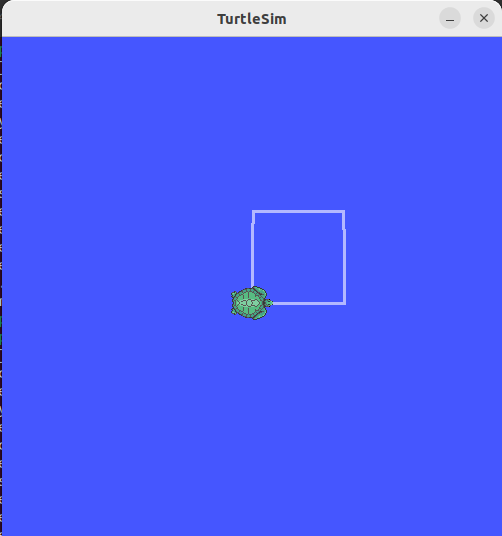
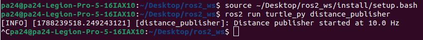
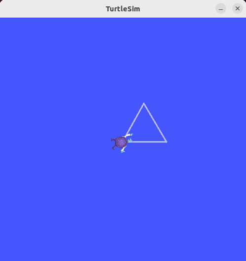
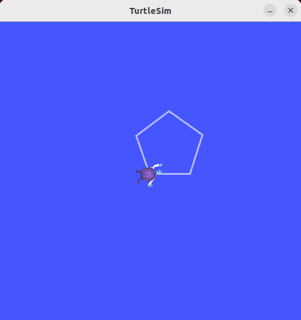
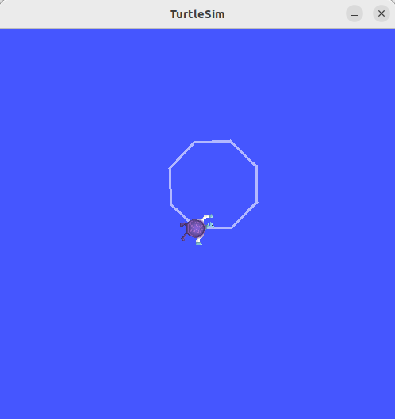
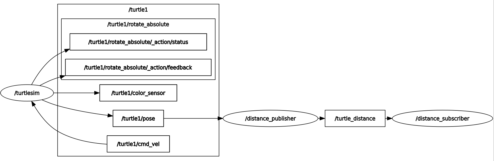
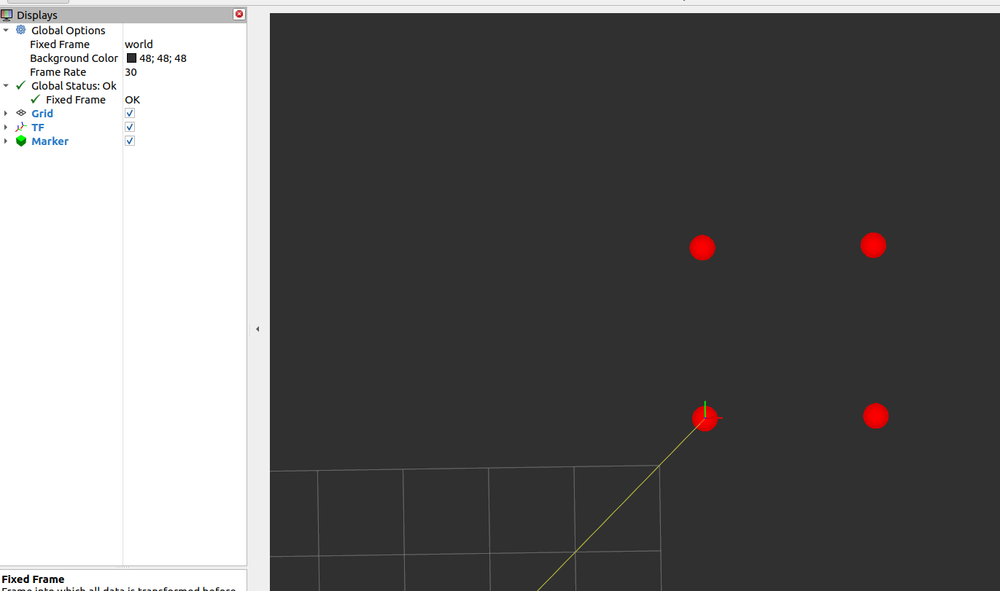

# 모듈 ② 과제 — turtlesim 기반 C++·Python ROS2 패키지 개발

> **작성자**: 정수용  
> **환경**: Ubuntu 22.04 LTS / ROS2 Humble Hawksbill  
> **작성일**: 2026-09-01

---

## 문제 1. C++ 빌드 체계 세우기 — g++ 다중 파일 빌드와 CMake 전환

### 1-0. stop_distance.cpp를  g++ -Wall -std=c++17로 빌드·실행

  ```
#include <iostream>

#include <cmath>

  

double compute_stop_distance(double speed, double friction) {

constexpr double g = 9.81;

return (speed * speed) / (2.0 * friction * g);

}

  

int main() {

double speed, friction;

  

std::cout << "속도 [m/s]: ";

std::cin >> speed;

std::cout << "마찰계수: ";

std::cin >> friction;

  

if (speed < 0.0 || friction <= 0.0) {

std::cerr << "오류: 속도 >= 0, 마찰계수 > 0 이어야 합니다. \n";

return 1;

}

  

double dist = compute_stop_distance(speed, friction);

std::cout << "정지 거리: " << dist << " m\n";

  

return 0;

}
  ```
-  현재 터미널 파일 경로에서 g++ -Wall -std=c++17 -o stop_distance stop_distance.cpp 입력 후  
    ./stop_distance를 입력한다.
    
- 속도: 10, 마찰 계수 0.7를 입력하면 정지 거리가 7.2812m가 나온다.

---

### 1-1. 수동 2단계 빌드 명령

```bash
# 컴파일 단계 (소스 → 오브젝트 파일)
g++ -Wall -std=c++17 -c motor.cpp -o motor.o
g++ -Wall -std=c++17 -c main.cpp -o main.o

# 링크 단계 (오브젝트 파일 → 실행 파일)
g++ motor.o main.o -o motor_app
```

-  **실행 출력: **
[Motor] left_wheel 생성됨 (최대 3000 RPM)
[Motor] right_wheel 생성됨 (최대 3000 RPM)
[Motor] left_wheel 속도 설정: 1500 RPM
[Motor] right_wheel 속도 설정: 3000 RPM

   `=== 모터 상태 ===`
left_wheel: 1500 RPM
right_wheel: 3000 RPM

-  **설명:  ** 컴파일 단계에서 각 .cpp를 독립적으로 기계어(.o)로 변환하고 링크 단계에서 오브젝트 파일들을 하나로 합쳐 실행 파일을 만든다.
### 1-2. `undefined reference` 에러 메시지

-  **실행 명령:** ```bash g++ main.o -o motor_app ``` 
-  **에러 출력:** 
     ```
/usr/bin/ld: main.o: in function `main':
main.cpp:(.text+0x66): undefined reference to `Motor::Motor(std::__cxx11::basic_string<char, std::char_traits<char>, std::allocator<char> > const&, double)'
/usr/bin/ld: main.cpp:(.text+0xd2): undefined reference to `Motor::Motor(std::__cxx11::basic_string<char, std::char_traits<char>, std::allocator<char> > const&, double)'
/usr/bin/ld: main.cpp:(.text+0x108): undefined reference to `Motor::set_speed(double)'
/usr/bin/ld: main.cpp:(.text+0x120): undefined reference to `Motor::set_speed(double)'
/usr/bin/ld: main.cpp:(.text+0x14f): undefined reference to `Motor::get_name[abi:cxx11]() const'
/usr/bin/ld: main.cpp:(.text+0x18c): undefined reference to `Motor::get_speed() const'
/usr/bin/ld: main.cpp:(.text+0x1d8): undefined reference to `Motor::get_name[abi:cxx11]() const'
/usr/bin/ld: main.cpp:(.text+0x215): undefined reference to `Motor::get_speed() const'
collect2: error: ld returned 1 exit status

     ```

**컴파일 에러와의 차이 설명:** motor.o를 링크에서 빠뜨리면, 컴파일은 motor.hpp 선언만 보고 통과하지만 링크 단계에서 실제 구현체를 찾지 못해 `undefined reference` 에러가 발생한다.

| 구분      | 컴파일 에러                        | 링크 에러                    |
| ------- | ----------------------------- | ------------------------ |
| 발생 시점   | 컴파일 단계 (`g++ -c`)             | 링크 단계 (`g++ .o → 실행파일`)  |
| 원인      | 문법 오류, 타입 불일치, 헤더 누락          | 선언은 있지만 구현 코드(.o)를 찾지 못함 |
| 메시지 키워드 | error, expected, unknown type | undefined reference to   |
| 1-2 케이스 | motor.hpp로 선언은 알고 있음          | motor.o를 안 줘서 구현체를 못 찾음  |

---

### 1-3. CMake 빌드 출력

**실행 명령: **
```bash
mkdir -p build && cd build
cmake .. 
make 
./motor_app
```
**빌드 출력: **
```
#CMake ..
-- Detecting CXX compiler ABI info  
-- Detecting CXX compiler ABI info - done  
-- Check for working CXX compiler: /usr/bin/c++ - skipped  
-- Detecting CXX compile features  
-- Detecting CXX compile features - done  
-- Configuring done  
-- Generating done  
-- Build files have been written to: /home/pa24/Desktop/lv1_module2_정수용/cpp_basics/build

#Make  
[ 33%] Building CXX object CMakeFiles/motor_app.dir/main.cpp.o  
[ 66%] Building CXX object CMakeFiles/motor_app.dir/motor.cpp.o  
[100%] Linking CXX executable motor_app  
[100%] Built target motor_app

#./motor_app
[Motor] left_wheel 생성됨 (최대 3000 RPM)
[Motor] right_wheel 생성됨 (최대 3000 RPM)
[Motor] left_wheel 속도 설정: 1500 RPM
[Motor] right_wheel 속도 설정: 3000 RPM

=== 모터 상태 ===
left_wheel: 1500 RPM
right_wheel: 3000 RPM

```
**설명: **  cmake ..`이 CMakeLists.txt를 읽어 Makefile을 생성하고 `make`가 그 Makefile에 따라 main.cpp → motor.cpp → 링크 순서로 빌드를 수행한다. 수동 빌드에서 일일이 쳤던 g++ 명령들을 CMake가 자동으로 관리해준다.

---

### 1-4. 증분 빌드 시 재컴파일된 파일

-  **재컴파일된 파일**: motor.cpp.o 
-  **판단 근거**: make는 소스 파일과 오브젝트 파일의 타임스탬프를 비교한다. motor.cpp만 수정되어 타임스탬프가 motor.cpp.o보다 새로워졌으므로 motor.cpp.o만 다시 생성하고 변경 없는 main.cpp.o는 그대로 재사용한다. 이것이 증분 빌드의 원리로 대규모 프로젝트에서 빌드 시간을 크게 줄여준다.
-  **실행 명령: **
    - ```bash
      echo "// modified" >> ../motor.cpp
      make
      ```
-  **출력:**
    - ```
      Consolidate compiler generated dependencies of target motor_app  
[ 33%] Building CXX object CMakeFiles/motor_app.dir/motor.cpp.o  
[ 66%] Linking CXX executable motor_app  
[100%] Built target motor_app
      ```

---

## 문제 2. 현대 C++로 센서 계층 구현 — RAII·다형성·STL

### 2-1. 다형성 루프 출력

-  **실행 명령:**
```bash
cd ~/Desktop/lv1_module2_정수용/cpp_basics/sensors/
g++ -Wall -std=c++17 -o sensor_test main.cpp 
./sensor_test
```
-  **출력: ** 
```
===== 1. 다형성 루프 =====
[Sensor 생성] front_lidar  
[Sensor 생성] body_imu  
[Sensor 생성] rear_lidar  
[Lidar] front_lidar 거리: 3.33 m  
[Imu] body_imu 가속도: 10.17 m/s²  
[Lidar] rear_lidar 거리: 3.27 m

   `===== 프로그램 종료, 소멸 순서 관찰 =====`
[Lidar 소멸] front_lidar
[Sensor 소멸] front_lidar
[Imu 소멸] body_imu
[Sensor 소멸] body_imu
[Lidar 소멸] rear_lidar
[Sensor 소멸] rear_lidar
```


-  **설명: ** Sensor 포인터 벡터에서 동일한 `read()`를 호출하지만 Lidar는 거리를, Imu는 가속도를 출력한다. 이것이 가상 함수를 통한 다형성으로 센서 종류가 늘어나도 루프 코드를 수정할 필요가 없다.


---

### 2-2. 스택 객체와 힙 객체의 소멸 시점

-  **출력: **
 ` ===== 2. 스택 vs 힙 소멸 시점 =====`
-- 블록 시작 --
[Sensor 생성] stack_sensor
[Sensor 생성] heap_sensor
[Lidar] stack_sensor 거리: 2.65 m
[Lidar] heap_sensor 거리: 3.43 m
-- 블록 끝 --
[Lidar 소멸] heap_sensor
[Sensor 소멸] heap_sensor
[Lidar 소멸] stack_sensor
[Sensor 소멸] stack_sensor
-- 블록 바깥 --
[Lidar 소멸] front_lidar
[Sensor 소멸] front_lidar
[Imu 소멸] body_imu
[Sensor 소멸] body_imu
[Lidar 소멸] rear_lidar
[Sensor 소멸] rear_lidar


-  **관찰 로그와 설명:**
두 경우 모두 블록이 끝나는 시점(`}`)에 소멸자가 호출된다. 스택은 컴파일러가, 힙은 unique_ptr(RAII)이 정리를 담당한다. raw new를 쓰면 아무도 정리하지 않아 누수가 발생한다.

| 구분 | 스택 (지역변수) | 힙 (unique_ptr) |
|---|---|---|
| 생성 방식 | Lidar stack_lidar(...) | std::make_unique\<Lidar\>(...) |
| 소멸 시점 | 블록 닫힐 때 자동 | 블록 닫힐 때 unique_ptr이 자동 정리 |
| 메모리 위치 | 스택 영역 (빠르지만 크기 제한) | 힙 영역 (크기 자유롭지만 관리 필요) |

---

### 2-3. 가상 소멸자를 뺐을 때의 차이
- **차이점**: virtual 소멸자를 제거하면 부모 포인터(unique_ptr\<Sensor\>)로 자식 객체를 삭제할 때 자식 소멸자([Lidar 소멸], [Imu 소멸])가 호출되지 않고 부모 소멸자([Sensor 소멸])만 호출된다. 자식 클래스에서 할당한 리소스(센서 연결 해제, 파일 닫기 등)가 정리되지 않아 메모리·리소스 누수가 발생한다. 또한 override 키워드가 있으면 이 실수를 컴파일 시점에 잡아주므로 virtual 소멸자와 override를 함께 쓰는 것이 안전하다.

--- 

### 2-4. `count_if` 결과

- 0.35 이내 기록: **3** 개
- **출력: **
```
===== 3. unordered_map + count_if =====
[Lidar] front_lidar 거리: 2.85 m
[Imu] body_imu 가속도: 10.17 m/s²
[Lidar] rear_lidar 거리: 3.42 m

최근 측정값:
  rear_lidar = 3.42
  body_imu = 10.17
  front_lidar = 2.85

거리 로그 10개 중 0.35 이내: 3개
```


---

### 2-4-1. 함수 탬플릿 clamp
 -  **실행 명령: **
```bash
g++ -Wall -std=c++17 -o sensor_test main.cpp
./sensor_test
```
-  **출력: **
  `===== 4. 함수 템플릿 clamp =====`  
속도 15.7 → clamp(0~10): 10  
픽셀 300 → clamp(0~255): 255

-  **설명:** 하나의 템플릿 함수 my_clamp\<T\>를 정의하면 double과 int 양쪽 타입에 모두 적용된다. 컴파일러가 호출 시점의 타입을 보고 각각 my_clamp\<double\>과 my_clamp\<int\> 버전을 자동 생성한다. 코드 중복 없이 여러 타입을 처리할 수 있는 것이 C++ 템플릿의 핵심이다.

---

### 2-5. 누수 검출 결과 → 수정 후 결과

-  **실행 명령: **
```bash
# AddressSanitizer로 누수 검출
g++ -Wall -std=c++17 -fsanitize=address -o sensor_test_asan main.cpp ./sensor_test_asan
```

-  **수정 전 (new/delete 누락)**:

```
--- new로 할당, delete 없이 루프 ---  
[Sensor 생성] leak_lidar_0  
[Lidar] leak_lidar_0 거리: 2.99 m  
[Sensor 생성] leak_lidar_1  
[Lidar] leak_lidar_1 거리: 2.71 m  
[Sensor 생성] leak_lidar_2  
[Lidar] leak_lidar_2 거리: 3.12 m  
[Sensor 생성] leak_lidar_3  
[Lidar] leak_lidar_3 거리: 2.77 m  
[Sensor 생성] leak_lidar_4  
[Lidar] leak_lidar_4 거리: 3.4 m  
--- 루프 끝 (소멸 로그 없음 = 누수!) ---

==59092==ERROR: LeakSanitizer: detected memory leaks  
Direct leak of 200 byte(s) in 5 object(s) allocated from:  
#0 0x7b58c26b61e7 in operator new(unsigned long)  
#1 0x590d493ead0b in main  
SUMMARY: AddressSanitizer: 200 byte(s) leaked in 5 allocation(s).

```

-  **수정 후 (make_unique 적용)**:

```
--- make_unique로 수정 ---  
[Sensor 생성] safe_lidar_0  
[Lidar] safe_lidar_0 거리: 3.09 m  
[Lidar 소멸] safe_lidar_0  
[Sensor 소멸] safe_lidar_0  
[Sensor 생성] safe_lidar_1  
[Lidar] safe_lidar_1 거리: 3.13 m  
[Lidar 소멸] safe_lidar_1  
[Sensor 소멸] safe_lidar_1  
[Sensor 생성] safe_lidar_2  
[Lidar] safe_lidar_2 거리: 2.76 m  
[Lidar 소멸] safe_lidar_2  
[Sensor 소멸] safe_lidar_2  
[Sensor 생성] safe_lidar_3  
[Lidar] safe_lidar_3 거리: 2.9 m  
[Lidar 소멸] safe_lidar_3  
[Sensor 소멸] safe_lidar_3  
[Sensor 생성] safe_lidar_4  
[Lidar] safe_lidar_4 거리: 2.76 m  
[Lidar 소멸] safe_lidar_4  
[Sensor 소멸] safe_lidar_4  
--- 루프 끝 (소멸 로그 있음 = 누수 없음) ---

```

-  **검출 도구: ** g++ -fsanitize=address (AddressSanitizer)
-  **설명: ** new로 할당한 객체를 delete하지 않으면 소멸자가 호출되지 않아 메모리 누수가 발생한다. AddressSanitizer가 5개 객체에서 200바이트 누수를 정확히 검출했다. make_unique로 바꾸면 블록이 끝날 때 자동으로 소멸자가 호출되어 누수가 사라진다.

---

## 문제 3. rclpy 노드 작성 — 거북이 상태 발행자와 구독자

### 3-0. `turtle_py` 패키지를 `ament_python` 빌드 타입으로 생성
-  **실행 명령: **
```
cd ~/Desktop/ros2_ws/src
ros2 pkg create turtle_py --build-type ament_python --dependencies rclpy std_msgs turtlesim geometry_msgs
```


### 3-1. `/turtle1/pose` 필드 구성
-  **`ros2 topic echo /turtle1/pose` 로 확인한 필드: **
    - ```
      x: 5.544444561004639  
y: 5.544444561004639  
theta: 0.0  
linear_velocity: 0.0  
angular_velocity: 0.0
      ```


-  **`ros2 interface show turtlesim/msg/Pose` 로 확인한 타입**
    - ```
      float32 x
      float32 y 
      float32 theta 
      float32 linear_velocity 
      float32 angular_velocity
      ```


### 3-2. `ros2 topic hz /turtle_distance` 출력

#### 3-2-0. 구현 설명
- `/turtle1/pose` 구독 → 원점 거리 계산 → `/turtle_distance`에 `std_msgs/msg/Float32`로 10Hz 발행 
    -  구독 콜백: 최신 pose 저장만 
    -  타이머 콜백: 거리 계산 및 발행 (10Hz) 
    -  파라미터 `publish_rate` (기본 10.0) 선언, 실행 중 변경 가능
    -  파일: `turtle_py/distance_publisher.py`
<br>

-  **실행 명령: **
  ```
  먼저 source ~/Desktop/ros2_ws/install/setup.bash를 터미널에 실행
  그 후 ros2 topic hz /turtle_distance 실행
  ```
-  **출력: **
```
average rate: 10.002
	min: 0.099s max: 0.101s std dev: 0.00053s window: 12
average rate: 10.000
	min: 0.099s max: 0.101s std dev: 0.00040s window: 22
average rate: 10.000
	min: 0.099s max: 0.101s std dev: 0.00034s window: 32
average rate: 10.000
	min: 0.099s max: 0.101s std dev: 0.00030s window: 43
average rate: 10.000
	min: 0.099s max: 0.101s std dev: 0.00028s window: 53
average rate: 10.000
	min: 0.099s max: 0.101s std dev: 0.00026s window: 63
average rate: 10.000
	min: 0.099s max: 0.101s std dev: 0.00024s window: 74
average rate: 10.000
	min: 0.099s max: 0.101s std dev: 0.00023s window: 84
average rate: 10.000
	min: 0.099s max: 0.101s std dev: 0.00022s window: 95
average rate: 10.000
	min: 0.099s max: 0.101s std dev: 0.00021s window: 106
average rate: 10.000
	min: 0.099s max: 0.101s std dev: 0.00020s window: 117
average rate: 10.000
	min: 0.099s max: 0.101s std dev: 0.00026s window: 128
average rate: 10.000
	min: 0.099s max: 0.101s std dev: 0.00026s window: 138
average rate: 10.000
	min: 0.099s max: 0.101s std dev: 0.00025s window: 149
average rate: 10.000
	min: 0.099s max: 0.101s std dev: 0.00024s window: 160
average rate: 10.000
	min: 0.099s max: 0.101s std dev: 0.00024s window: 171

```
- **평균 주파수**: 10 Hz


---

### 3-3. 구독자 경고 로그
- **구현 설명: **
    -  `/turtle_distance` 구독 -> 임계값(기본 2.5) 초과 시 경고 로그
    - 파라미터 `warn_distance` (기본 2.5) 선언, 실행 중 `ros2 param set` 으로 변경 가능
    -  파일: `turtle_py/distance_subscriber.py`

-  **실행 명령: **
```
source ~/Desktop/ros2_ws/install/setup.bash
ros2 run turtle_py distance_subscriber
```
-  **출력: **
```
[WARN] [1788762530.887937205] [distance_subscriber]: Turtle too far from origin! distance=7.84, threshold=2.5
[WARN] [1788762530.987590638] [distance_subscriber]: Turtle too far from origin! distance=7.84, threshold=2.5
[WARN] [1788762531.087541006] [distance_subscriber]: Turtle too far from origin! distance=7.84, threshold=2.5
[WARN] [1788762531.187501079] [distance_subscriber]: Turtle too far from origin! distance=7.84, threshold=2.5
[WARN] [1788762531.287677074] [distance_subscriber]: Turtle too far from origin! distance=7.84, threshold=2.5
```
-  **설명:  ** `ros2 topic echo /turtle1/pose`로 확인한 거북이 초기 위치는 (5.54, 5.54)이다. 원점까지 거리는 √(5.54² + 5.54²) ≈ 7.84로, 임계값 2.5을 초과하므로 WARN 로그가 10Hz 간격으로 출력된다.
  
---

### 3-4. 구독자 2개 동시 수신 확인
-  터미널 1: turtlesim_node (거북이)
-  터미널 2: distance_publisher (발행자)
-  터미널 3: distance_subscriber(1) (구독자 1)
-  터미널 4: distance_subscriber(2) (구독자 2)
-  위와 같이 4개의 터미널 창을 띄운다.
    -  **구독자를 2개 동시에 띄워 하나의 발행이 양쪽에 전달되는지 확인(Topic 1:N 통신)**
<br>
-  **실행 명령: **
```
source ~/Desktop/ros2_ws/install/setup.bash
ros2 run turtle_py distance_subscriber
```
-  **출력: **
-  터미널 3: distance_subscriber(1) 출력 화면
     -  [INFO] [1788762735.713715335] [distance_subscriber]: Distance subscriber started
[WARN] [1788762735.837389682] [distance_subscriber]: Turtle too far from origin! distance=7.84, threshold=2.5
[WARN] [1788762735.887362118] [distance_subscriber]: Turtle too far from origin! distance=7.84, threshold=2.5
[WARN] [1788762735.987509594] [distance_subscriber]: Turtle too far from origin! distance=7.84, threshold=2.5
[WARN] [1788762736.087479834] [distance_subscriber]: Turtle too far from origin! distance=7.84, threshold=2.5
[WARN] [1788762736.187425203] [distance_subscriber]: Turtle too far from origin! distance=7.84, threshold=2.5
<br>
- 터미널 4: distance_subscriber(2) 출력 화면
    -  [INFO] [1788762739.283213900] [distance_subscriber]: Distance subscriber started
[WARN] [1788762739.287320697] [distance_subscriber]: Turtle too far from origin! distance=7.84, threshold=2.5
[WARN] [1788762739.387552535] [distance_subscriber]: Turtle too far from origin! distance=7.84, threshold=2.5
[WARN] [1788762739.487477195] [distance_subscriber]: Turtle too far from origin! distance=7.84, threshold=2.5
[WARN] [1788762739.587500884] [distance_subscriber]: Turtle too far from origin! distance=7.84, threshold=2.5
[WARN] [1788762739.687534226] [distance_subscriber]: Turtle too far from origin! distance=7.84, threshold=2.5


---

### 3-5. 정사각형 주행 캡처
-  **구현 설명: **
    -  `/turtle1/cmd_vel`에 `geometry_msgs/msg/Twist` 발행
    -  전진과 제자리 회전을 번갈아 수행하여 정사각형 한 바퀴 이동
    -  상태 머신(forward -> turn)으로 구현, 4변 완료 후 자동 정지
    -  파일: `turtle_py/square_driver.py`
<br>
-  **실행 명령: **
```
source ~/Desktop/ros2_ws/install/setup.bash  
ros2 run turtle_py square_driver
```
- **출력 결과: **
- 
### 3-6. Ctrl+C 정상 종료 화면
-  **구현 설명: **
    -  노드 생명주기 명시적 관리 (3개 노드 모드 동일 구조):
    - ```
      rclpy.init(args=args) # 1) 초기화 
      node = DistancePublisher() # 2) 노드 생성 
      rclpy.spin(node) # 3) 콜백 루프 
      node.destroy_node() # 4) 노드 정리 
      rclpy.shutdown() # 5) ROS2 종료
      ```
    - `KeyboardInterrupt` 처리로 Ctrl + C 시 예외 없이 정상 종료  
- 
---

## 문제 4. rclcpp 노드 작성 — C++ 발행자와 구독자

### 4-0. `turtle_cpp` 패키지를 `ament_cmake` 빌드 타입으로 생성
-  **실행 명령: **
```
cd ~/Desktop/ros2_ws/src
ros2 pkg create turtle_cpp --build-type ament_cmake --dependencies rclcpp std_msgs turtlesim
```
-  **출력: **
```
creating source and include folder
creating folder ./turtle_cpp/src
creating folder ./turtle_cpp/include/turtle_cpp
creating ./turtle_cpp/CMakeLists.txt

[WARNING]: Unknown license 'TODO: License declaration'.  This has been set in the package.xml, but no LICENSE file has been created.
It is recommended to use one of the ament license identitifers:
Apache-2.0
BSL-1.0
BSD-2.0
BSD-2-Clause
BSD-3-Clause
GPL-3.0-only
LGPL-3.0-only
MIT
MIT-0
```

---

### 4-1. `colcon build` 성공 출력
-  **구현 설명: **
    -  `CMakeLists.txt`에 `find_package`(rclcpp, std_msgs, turtlesim), `add_executable`(distance_publisher, distance_subscriber), `ament_target_dependencies`, `install(TARGETS ...)`을 선언하여 `colcon build`가 통과하도록 구성함.
<br>
-  **실행 명령: **
```
cd ~/Desktop/ros2_ws  
colcon build --packages-select turtle_cpp
```
-  **출력: **
```
Starting >>> turtle_cpp
Finished <<< turtle_cpp [5.29s]                     

Summary: 1 package finished [5.50s]
```

---

### 4-2. rclpy 발행에서 rclcpp 구독으로 이어진 로그

-  **구현 설명: **
    -  Python `distance_publisher`(문제 3)가 `/turtle_distance` 를 발행
    -  C++ 구독자가 같은 토픽을 구독해 로그 출력
    - 언어가 달라도 같은 토픽, 같은 메시지 타입이면 통신이 되는 것을 증명한다.
    
-  **실행 명령: **
```
source ~/Desktop/ros2_ws/install/setup.bash
ros2 run turtle_cpp distance_subscriber
```
-  **출력: **
```
[INFO] [1788242921.202582866] [distance_subscriber_cpp]: C++ Distance subscriber started
[INFO] [1788242921.230426363] [distance_subscriber_cpp]: distance=7.84
[INFO] [1788242921.330521452] [distance_subscriber_cpp]: distance=7.84
[INFO] [1788242921.430520363] [distance_subscriber_cpp]: distance=7.84
[INFO] [1788242921.530546789] [distance_subscriber_cpp]: distance=7.84
[INFO] [1788242921.630549667] [distance_subscriber_cpp]: distance=7.84

```
---

### 4-3. rclpy와 rclcpp 대응 관계표

- **rclpy 코드 (distance_publisher.py) **
```python
import rclpy 
from rclpy.node import Node 
from turtlesim.msg import Pose 
from std_msgs.msg import Float32 
import math 

class DistancePublisher(Node): 
    def __init__(self): 
    super().__init__('distance_publisher')
    self.declare_parameter('publish_rate', 10.0) 
    self.last_pose = None 
    self.pose_sub = self.create_subscription( 
        Pose, '/turtle1/pose', self.pose_callback, 10) 
    self.dist_pub = self.create_publisher(Float32, '/turtle_distance', 10) 
    rate = self.get_parameter('publish_rate').value 
    self.timer = self.create_timer(1.0 / rate, self.timer_callback)
    self.get_logger().info(f'Distance publisher started at {rate} Hz')
    
    def pose_callback(self, msg):
        self.last_pose = msg 
    
    def timer_callback(self): 
        if self.last_pose is None:
            return
        distance = math.sqrt(self.last_pose.x ** 2 + self.last_pose.y ** 2)
        msg = Float32() 
        msg.data = distance
        self.dist_pub.publish(msg)
        
        
def main(args=None):
    rclpy.init(args=args)
    node = DistancePublisher()
    try: 
        rclpy.spin(node)
    except KeyboardInterrupt:
        pass
    finally: 
        node.destroy_node()
        try: 
            rclpy.shutdown()
        except Exception: 
            pass 
            
            
if __name__ == '__main__': 
    main() 
```

-  **rclcpp 코드 (distance_publisher.cpp)**
``` cpp 
#include <rclcpp/rclcpp.hpp> 
#include <std_msgs/msg/float32.hpp> 
#include <turtlesim/msg/pose.hpp> 
#include <cmath> 

class DistancePublisher : public rclcpp::Node 
{ 
public: 
    DistancePublisher() : Node("distance_publisher_cpp") 
    { 
    pose_sub_ = this->create_subscription<turtlesim::msg::Pose>(
        "/turtle1/pose", 10, 
        [this](const turtlesim::msg::Pose::SharedPtr msg) { 
            last_pose_ = *msg; 
            pose_received_ = true; 
            }); 
    dist_pub_ = this->create_publisher<std_msgs::msg::Float32>(
        "/turtle_distance", 10);
    timer_ = this->create_wall_timer( 
        std::chrono::milliseconds(100),
        std::bind(&DistancePublisher::timer_callback, this)); 
    RCLCPP_INFO(this->get_logger(), "C++ Distance publisher started at 10 Hz");      } 

private: 
    void timer_callback() 
    { 
        if (!pose_received_) return; 
        auto msg = std_msgs::msg::Float32(); 
        msg.data = std::sqrt(last_pose_.x * last_pose_.x + last_pose_.y * last_pose_.y); dist_pub_->publish(msg);
    } 
    
    rclcpp::Subscription<turtlesim::msg::Pose>::SharedPtr pose_sub_;
    rclcpp::Publisher<std_msgs::msg::Float32>::SharedPtr dist_pub_;
    rclcpp::TimerBase::SharedPtr timer_;
    turtlesim::msg::Pose last_pose_;
    bool pose_received_ = false; 
};
    
int main(int argc, char **argv) 
{ 
    rclcpp::init(argc, argv);
    rclcpp::spin(std::make_shared<DistancePublisher>());
    rclcpp::shutdown(); return 0; 
}

```

#### rclpy와 rclcpp 대응 관계표

| 항목 | rclpy (Python) | rclcpp (C++) |
|---|---|---|
| 노드 생성 | `class DistancePublisher(Node)` + `super().__init__(이름)` | `class DistancePublisher : public rclcpp::Node` + 생성자 `Node(이름)` |
| 타이머 | `self.create_timer(0.1, self.timer_callback)` | `create_wall_timer(100ms, std::bind(&...::timer_callback, this))` |
| 콜백 | `def timer_callback(self):` → `self.dist_pub.publish(msg)` | `void timer_callback()` → `dist_pub_->publish(msg);` |
| 종료 | `rclpy.init()` → `spin()` → `destroy_node()` → `rclpy.shutdown()` | `rclcpp::init()` → `spin()` → `rclcpp::shutdown()` |

## 문제 5. Service와 Action — 즉시 응답과 장기 작업

### 5-1. 호출한 내장 서비스와 타입

| 서비스 이름                     | 타입                             | 요청 값                                  | 결과              |
| -------------------------- | ------------------------------ | ------------------------------------- | --------------- |
| /turtle1/teleport_absolute | turtlesim/srv/TeleportAbsolute | x=5.5, y=5.5, theta=0.0               | 응답 필드 없음 (OK)   |
| /turtle1/set_pen           | turtlesim/srv/SetPen           | r=255, g=0, b=0, width=4, off=0       | 응답 필드 없음 (OK)   |
| /spawn                     | turtlesim/srv/Spawn            | x=2.0, y=2.0, theta=0.0, name=turtle2 | name=turtle2 반환 |
| /clear                     | std_srvs/srv/Empty             | (요청 필드 없음)                            | 응답 필드 없음 (OK)   |

### 5-2. Service 요청·응답 로그

```
[INFO] [1788765709.124255176] [builtin_service_client]: [1/4] teleport_absolute(5.5, 5.5, 0.0) → OK
[INFO] [1788765709.134669050] [builtin_service_client]: [2/4] set_pen(r=255, g=0, b=0, width=4, off=0) → OK
[INFO] [1788765709.152486529] [builtin_service_client]: [3/4] spawn → 새 거북이 이름 "turtle2" (ros2 topic list 에서 /turtle2/pose 확인)
[INFO] [1788765709.167244028] [builtin_service_client]: [4/4] clear → OK


```

### 5-3. 데드락이 생기는 이유

-  SingleThreadedExecutor는 단일 스레드로 한 번에 콜백을 하나만 실행할 수 있다. 콜백 내부에서 서비스 응답을 동기로 대기하면 해당 응답 이벤트를 처리해야 할 유일한 executor의 실행 권한이 현재 콜백에 묶이게 된다. 콜백은 응답 도착을 기다리고 executor는 현재 콜백의 종료를 기다리며 상호 순환 대기(데드락)가 발생합니다.

### 5-4. `rotate_absolute` 피드백 수신 로그

```
[INFO] [1788765995.314426551] [rotate_absolute_client]: goal 전송: theta = 3.000 rad (현재 theta = None)
[INFO] [1788765995.326799308] [rotate_absolute_client]: 피드백: remaining = +3.000 rad
[INFO] [1788765995.327037492] [rotate_absolute_client]: goal 수락됨 — 피드백 대기
[INFO] [1788765995.582909857] [rotate_absolute_client]: 피드백: remaining = +2.744 rad
[INFO] [1788765995.838943681] [rotate_absolute_client]: 피드백: remaining = +2.488 rad
[INFO] [1788765996.094866888] [rotate_absolute_client]: 피드백: remaining = +2.232 rad
[INFO] [1788765996.350483836] [rotate_absolute_client]: 피드백: remaining = +1.976 rad
[INFO] [1788765996.606625509] [rotate_absolute_client]: 피드백: remaining = +1.720 rad
[INFO] [1788765996.862966967] [rotate_absolute_client]: 피드백: remaining = +1.464 rad
[INFO] [1788765997.120479589] [rotate_absolute_client]: 피드백: remaining = +1.208 rad
[INFO] [1788765997.375536178] [rotate_absolute_client]: 피드백: remaining = +0.952 rad
[INFO] [1788765997.630666722] [rotate_absolute_client]: 피드백: remaining = +0.696 rad
[INFO] [1788765997.887270310] [rotate_absolute_client]: 피드백: remaining = +0.440 rad
[INFO] [1788765998.143234230] [rotate_absolute_client]: 피드백: remaining = +0.184 rad
[INFO] [1788765998.319022509] [rotate_absolute_client]: 결과 수신: status=SUCCEEDED, delta=-2.992 rad, 현재 theta = 2.992000102996826

[INFO] [1788766117.287492385] [rotate_absolute_client]: goal 전송: theta = 3.000 rad (현재 theta = None)
[INFO] [1788766117.295133021] [rotate_absolute_client]: 피드백: remaining = +0.008 rad
[INFO] [1788766117.295364847] [rotate_absolute_client]: goal 수락됨 — 피드백 대기
[INFO] [1788766117.311370382] [rotate_absolute_client]: 결과 수신: status=SUCCEEDED, delta=+0.000 rad, 현재 theta = 2.992000102996826

```

### 5-5. 취소 요청 처리 로그

```
[INFO] [1788766411.112773814] [rotate_absolute_client]: goal 전송: theta = 3.000 rad (현재 theta = None)
[INFO] [1788766411.119321225] [rotate_absolute_client]: 피드백: remaining = +3.000 rad
[INFO] [1788766411.119544248] [rotate_absolute_client]: goal 수락됨 — 피드백 대기
[INFO] [1788766411.375335934] [rotate_absolute_client]: 피드백: remaining = +2.744 rad
[INFO] [1788766411.631534434] [rotate_absolute_client]: 피드백: remaining = +2.488 rad
[INFO] [1788766411.887056212] [rotate_absolute_client]: 피드백: remaining = +2.232 rad
[WARN] [1788766412.119838919] [rotate_absolute_client]: 취소 요청 전송 (요청 시점 theta = 1.008 rad)
[WARN] [1788766412.127498885] [rotate_absolute_client]: 취소 수락됨 (서버가 중단 처리 중). 취소 시점 theta = 1.008 rad
[INFO] [1788766412.127699303] [rotate_absolute_client]: 결과 수신: status=CANCELED, delta=-0.992 rad, 현재 theta = 1.0080000162124634


```

- **취소 시점 각도**: 1.008 rad

### 5-6. 통신 패턴 설계표

| 기능         | 선택한 패턴  | 근거                                                                       |
| ---------- | ------- | ------------------------------------------------------------------------ |
| 자세 스트리밍    | Topic   | 연속 데이터를 다수 구독자에게 1:N으로 비동기 전달. 요청-응답 없이 주기적으로 흘러야 하므로 Service/Action 부적합 |
| 순간이동       | Service | 즉시 완료되는 1회성 요청-응답. 피드백이나 취소가 필요 없고 결과 확인만 하면 됨                           |
| 목표 각도까지 회전 | Action  | 수 초 걸리는 장기 작업이므로 진행 중 피드백(remaining)과 중간 취소가 필요                          |
| 펜 색 설정     | Service | 즉시 완료되는 설정 변경. 결과가 성공/실패뿐이고 진행 과정이 없음                                    |
| 거북이 추가     | Service | 1회성 요청이고 생성된 이름을 응답으로 받아야 함. 장기 작업이 아님                                   |

---

## 문제 6. 커스텀 인터페이스 정의 — 경유점 메시지와 다각형 액션

### 6-1. `ros2 interface show turtle_interfaces/msg/WaypointList` 출력

```
# 문제 6 — 경유점 목록. "중첩(다른 메시지를 필드로)" 과 "배열" 을 모두 사용합니다. # # 다른 패키지의 메시지를 쓸 때는 "패키지/타입" 으로 적습니다 (std_msgs/Header). # 같은 패키지의 메시지는 패키지 이름 없이 타입 이름만 적어도 됩니다 (Waypoint). # Waypoint[] 처럼 [] 를 붙이면 가변 길이 배열이 됩니다. (고정 길이는 Waypoint[4]) std_msgs/Header header # stamp(발행 시각) + frame_id(좌표계 이름, 여기서는 "world") builtin_interfaces/Time stamp int32 sec uint32 nanosec string frame_id Waypoint[] waypoints # 경유점 배열 — 문제 6 에서는 4개 이상을 채워 발행합니다 float64 x # 경유점 x 좌표 [m] (turtlesim 좌표계, 0 ~ 1 float64 y # float32 tolerance # 도달 판정 허용 오차 [m] — 이 거리 이내면 "도달" 로 봅니다 string label #

```

### 6-2. `ros2 topic echo /waypoints` 출력

```
header:
  stamp:
    sec: 1788766739
    nanosec: 209509745
  frame_id: world
waypoints:
- x: 2.0
  y: 2.0
  tolerance: 0.30000001192092896
  label: corner_A
- x: 9.0
  y: 2.0
  tolerance: 0.30000001192092896
  label: corner_B
- x: 9.0
  y: 9.0
  tolerance: 0.30000001192092896
  label: corner_C
- x: 2.0
  y: 9.0
  tolerance: 0.30000001192092896
  label: corner_D
---
header:
  stamp:
    sec: 1788767030
    nanosec: 819918712
  frame_id: world
waypoints:
- x: 2.0
  y: 2.0
  tolerance: 0.30000001192092896
  label: corner_A
- x: 9.0
  y: 2.0
  tolerance: 0.30000001192092896
  label: corner_B
- x: 9.0
  y: 9.0
  tolerance: 0.30000001192092896
  label: corner_C
- x: 2.0
  y: 9.0
  tolerance: 0.30000001192092896
  label: corner_D
---


```

### 6-3. `DrawPolygon` 피드백 로그
-  삼각형:
    -  Waiting for an action server to become available...
    Sending goal:
     sides: 3
    side_length: 2.0
    Goal accepted with ID: 55ab78e9cd0444eca3a68b551ec0ce04
    Feedback:
    completed_sides: 1
    progress: 0.3333333432674408
    Feedback:
    completed_sides: 2
    progress: 0.6666666865348816
    Feedback:
    completed_sides: 3
    progress: 1.0
    Result:
    total_distance: 6.0221863503143425
    Goal finished with status: SUCCEEDED
-  오각형:
    -  Waiting for an action server to become available... 
      Sending goal: 
      sides: 5 
      side_length: 1.5
      Goal accepted with ID: 97eb6913c6b0499798fbff238d078ffd 
      Feedback: 
      completed_sides: 1 
      progress: 0.20000000298023224 
      Feedback: 
      completed_sides: 2 
      progress: 0.4000000059604645 
      Feedback: 
      completed_sides: 3 
      progress: 0.6000000238418579 
      Feedback: 
      completed_sides: 4 
      progress: 0.800000011920929 
      Feedback: 
      completed_sides: 5 
      progress: 1.0 
      Result: 
      total_distance: 7.5349620678519305 
      Goal finished with status: SUCCEEDED

-  팔각형:
    -  Waiting for an action server to become available... 
      Sending goal: 
      sides: 8 
      side_length: 1.0 
      Goal accepted with ID: f58f389f380e423e84bfc7fb110a4396 
      Feedback: 
      completed_sides: 1 
      progress: 0.125 
      Feedback: 
      completed_sides: 2 
      progress: 0.25 
      Feedback: 
      completed_sides: 3 
      progress: 0.375 
      Feedback: 
      completed_sides: 4 
      progress: 0.5 
      Feedback: 
      completed_sides: 5 
      progress: 0.625 
      Feedback: 
      completed_sides: 6 
      progress: 0.75 
      Feedback: 
      completed_sides: 7 
      progress: 0.875 
      Feedback: 
      completed_sides: 8 
      progress: 1.0 
      Result: 
      total_distance: 8.061153943661173 
      Goal finished with status: SUCCEEDED

- **총 이동 거리**: 
    -  삼각형: 6.02m
    -  사각형: 7.53m
    -  팔각형: 8.06m

### 6-4. 삼각형·사각형·육각형 궤적 캡처

| 삼각형                                   | 오각형                                 | 팔각형                                 |
| ------------------------------------- | ----------------------------------- | ----------------------------------- |
|  |  |  |

### 6-5. 액션 취소 처리 결과

- **결과**: [INFO] [1788768605.663204379] [polygon_action_server]: polygon_action_server 시작: 액션 /draw_polygon 대기 중 [INFO] [1788768639.812694812] [polygon_action_server]: goal 수락: sides=8, side_length=1.0 [INFO] [1788768643.227952350] [polygon_action_server]: 변 1/8 완료 (누적 1.01 m) [INFO] [1788768646.638672539] [polygon_action_server]: 변 2/8 완료 (누적 2.01 m) [WARN] [1788768649.817587440] [polygon_action_server]: 취소 요청 수신 — 실행 루프에서 즉시 정지합니다 [WARN] [1788768649.849409571] [polygon_action_server]: 취소됨 — 정지. 그때까지 이동 거리 3.02 m

### 6-6. 인터페이스를 별도 패키지로 분리하는 이유
-  인터페이스 패키지(turtle_interfaces)는 rosidl_generate_interfaces로 .msg/.srv/.action 파일에서 C++/Python 바인딩 코드를 자동 생성한다. 이 빌드 과정은 일반 노드 패키지와 파이프라인이 다르다. 노드 패키지(turtle_py, turtle_cpp)가 인터페이스 타입을 import하려면 인터페이스가 먼저 빌드되어야 하는데, 같은 패키지 안에 넣으면 "자기 자신이 빌드되어야 자기 자신을 빌드할 수 있는" 순환 의존이 생긴다. 별도 패키지로 분리하면 colcon이 의존성 순서(turtle_interfaces → turtle_py → turtle_cpp)를 자동으로 잡아주고 여러 패키지에서 같은 인터페이스를 재사용할 수 있다.

---

## 문제 7. QoS 설정과 통신 단절 진단

### 7-1. QoS 비호환 시 `topic info --verbose` 출력

```
Type: std_msgs/msg/Float32

Publisher count: 1

Node name: qos_sensor_publisher
Node namespace: /
Topic type: std_msgs/msg/Float32
Endpoint type: PUBLISHER
GID: 01.0f.0f.26.75.33.7f.4a.00.00.00.00.00.00.12.03.00.00.00.00.00.00.00.00
QoS profile:
  Reliability: BEST_EFFORT
  History (Depth): UNKNOWN
  Durability: VOLATILE
  Lifespan: Infinite
  Deadline: Infinite
  Liveliness: AUTOMATIC
  Liveliness lease duration: Infinite

Subscription count: 1

Node name: qos_subscriber
Node namespace: /
Topic type: std_msgs/msg/Float32
Endpoint type: SUBSCRIPTION
GID: 01.0f.0f.26.83.33.df.6e.00.00.00.00.00.00.11.04.00.00.00.00.00.00.00.00
QoS profile:
  Reliability: RELIABLE
  History (Depth): UNKNOWN
  Durability: VOLATILE
  Lifespan: Infinite
  Deadline: Infinite
  Liveliness: AUTOMATIC
  Liveliness lease duration: Infinite

```

### 7-2. 연결되지 않은 원인과 수정

- **원인**: 발행자가 Best-Effort로 발행하는데 구독자가 Reliable을 요구한다. QoS 호환 규칙은 "제공(발행자)이 요청(구독자)보다 같거나 강해야 연결"인데, Best-Effort(약함)가 Reliable(강함)의 요구를 충족하지 못해 연결이 거부된다.
- **수정한 설정**: 구독자를 Best-Effort로 변경 (`--ros-args -p reliability:=best_effort`) 또는 발행자를 Reliable로 변경 (`--ros-args -p reliability:=reliable`)

### 7-3. Transient Local과 Volatile 수신 결과 비교

| 설정              | 늦게 띄운 구독자가 과거 메시지를 받는가? |
| --------------- | ----------------------- |
| TRANSIENT_LOCAL | 누적 1개 받음                |
| VOLATILE        | 누적 0개 받음                |

### 7-4. History depth 1에서의 메시지 누락 관찰

- **관찰 결과**: depth=1과 depth=10 모두 2초에 4개(=초당 2개)를 처리한다. 콜백이 0.5초 블록되므로 처리 속도가 초당 2개로 제한되기 때문이다. 차이는 **중간에 버려지는 메시지 수**에 있다. 발행이 10Hz이므로 0.5초 동안 5개가 도착하는데 depth=1이면 최신 1개만 남고 4개가 폐기된다. depth=10이면 5개 모두 큐에 쌓여 순서대로 처리된다. 처리량은 같아 보이지만 depth=1은 전체 메시지의 80%를 잃는다.

### 7-5. 토픽 5종 QoS 설계표

| 토픽                 | Reliability | Durability      | 근거                                                                    |
| ------------------ | ----------- | --------------- | --------------------------------------------------------------------- |
| `/turtle1/pose`    | RELIABLE    | VOLATILE        | 자세 데이터는 매 주기 갱신되므로 과거값 보관 불필요. 단, 거리 계산에 누락이 생기면 결과가 부정확해지므로 RELIABLE |
| `/turtle1/cmd_vel` | RELIABLE    | VOLATILE        | 속도 명령 누락 시 로봇이 의도와 다르게 움직임. 과거 명령은 이미 무효하므로 VOLATILE                  |
| `/waypoints`       | RELIABLE    | TRANSIENT_LOCAL | 경유점 목록은 한 번 발행 후 변하지 않는 설정값. 늦게 뜬 구독자도 받아야 하므로 TRANSIENT_LOCAL        |
| `/turtle_distance` | RELIABLE    | VOLATILE        | 10Hz 연속 스트림으로 최신값만 유효. 늦게 뜬 구독자에게 과거 거리를 줄 필요 없음                      |
| `/diagnostics`     | BEST_EFFORT | VOLATILE        | 진단 정보는 주기적으로 갱신되며 한두 개 누락돼도 다음 주기에 최신 상태가 옴. 재전송 오버헤드를 줄이는 것이 유리      |

---

## 문제 8. colcon 워크스페이스 구성 — 패키지 구조와 의존성

### 8-1. `colcon build` 빌드 순서 로그

```
Starting >>> turtle_interfaces
Starting >>> turtle_cpp
Starting >>> turtle_py
Finished <<< turtle_interfaces [0.33s]
Starting >>> turtle_examples
Finished <<< turtle_cpp [0.48s]
Finished <<< turtle_py [0.83s]
Finished <<< turtle_examples [0.66s]

Summary: 4 packages finished [1.16s]


```

- **인터페이스가 먼저 빌드되는 이유**: turtle_py와 turtle_examples가 turtle_interfaces의 메시지·서비스·액션 타입을 import해서 사용하므로, colcon이 package.xml의 의존성 선언을 보고 turtle_interfaces를 먼저 빌드한다. 인터페이스 패키지가 빌드되어야 Python/C++ 바인딩이 생성되고, 그 바인딩이 있어야 노드 패키지가 import할 수 있다.

### 8-2. `package.xml` 의존성 선언 부분

```xml
<depend>rclpy</depend> 
<depend>tf2_ros2</depend> 
<depend>visualization_msgs</depend> 
<depend>std_msgs</depend> 
<depend>turtlesim</depend> 
<depend>geometry_msgs</depend>

```
-  turtle_py는 turtle_interfaces, rclpy, geometry_msgs, turtlesim에 의존한다. turtle_py의 package.xml에 의존성을 정확히 선언해야 colcon이 빌드 순서를 올바르게 결정한다.
### 8-3. `setup.py` entry_points

```python
'console_scripts': [ 'distance_publisher = turtle_py.distance_publisher:main', 'distance_subscriber = turtle_py.distance_subscriber:main', 'square_driver = turtle_py.square_driver:main', 'tf_broadcaster = turtle_py.tf_broadcaster:main', 'waypoint_marker = turtle_py.waypoint_marker:main', ],

```

- **등록한 노드 목록**: distance_publisher, distance_subscriber, square_driver, tf_broadcaster, waypoint_marker

### 8-4. source 전 실행 결과와 source 후 실행 결과

**source 전**:

```
Package 'turtle_py' not found

```

**source 후**:

```
[INFO] [1788770321.618557081] [distance_publisher]: Distance publisher started at 10.0 Hz


```

### 8-5. 디렉터리 역할

| 디렉터리       | 역할                                                           |
| ---------- | ------------------------------------------------------------ |
| `src/`     | 패키지 소스 코드가 위치하는 곳. 개발자가 직접 편집하는 파일들이 여기 있다                   |
| `build/`   | 빌드 중간 산출물(오브젝트 파일, CMake 캐시 등)이 생성되는 곳. 패키지별 하위 폴더로 분리된다     |
| `install/` | 빌드 완료된 실행 파일, 라이브러리, 설정 파일이 설치되는 곳. ros2 run은 여기서 실행 파일을 찾는다 |
| `log/`     | colcon build와 colcon test의 로그가 저장되는 곳. 빌드 실패 시 원인 추적에 사용한다   |

---

## 문제 9. launch 파일로 시스템 기동 — 다중 노드와 파라미터 주입

### 9-1. `ros2 launch` 실행 출력

```
[INFO] [launch]: All log files can be found below /home/pa24/.ros/log/2026-09-07-17-43-58-885661-pa24-Legion-Pro-5-16IAX10-342566 [INFO] [launch]: Default logging verbosity is set to INFO [INFO] [launch.user]: params_file = /home/pa24/Desktop/ros2_ws/install/turtle_examples/share/turtle_examples/config/params.yaml [INFO] [turtlesim_node-1]: process started with pid [342567] [INFO] [ex03_distance_publisher-2]: process started with pid [342569] [INFO] [ex03_distance_subscriber-3]: process started with pid [342571] [INFO] [ex06_polygon_action_server-4]: process started with pid [342573] [turtlesim_node-1] [INFO] [1788770638.987813793] [turtlesim]: Starting turtlesim with node name /turtlesim [turtlesim_node-1] [INFO] [1788770638.989838047] [turtlesim]: Spawning turtle [turtle1] at x=[5.544445], y=[5.544445], theta=[0.000000] [ex03_distance_publisher-2] [INFO] [1788770639.084944659] [turtle_distance_publisher]: turtle_distance_publisher 시작: publish_rate=10.0 Hz [ex03_distance_subscriber-3] [INFO] [1788770639.106516298] [turtle_distance_subscriber]: turtle_distance_subscriber 시작: warn_distance=2.5 [ex06_polygon_action_server-4] [INFO] [1788770639.111897966] [polygon_action_server]: polygon_action_server 시작: 액션 /draw_polygon 대기 중 [ex03_distance_subscriber-3] [WARN] [1788770639.178959071] [turtle_distance_subscriber]: 경고: 원점 거리 7.84 m > 임계 2.50 m [ex03_distance_subscriber-3] [WARN] [1788770639.278961805] [turtle_distance_subscriber]: 경고: 원점 거리 7.84 m > 임계 2.50 m [ex03_distance_subscriber-3] [WARN] [1788770639.378688175] [turtle_distance_subscriber]: 경고: 원점 거리 7.84 m > 임계 2.50 m [ex03_distance_subscriber-3] [WARN] [1788770639.479391970] [turtle_distance_subscriber]: 경고: 원점 거리 7.84 m > 임계 2.50 m [ex03_distance_subscriber-3] [WARN] [1788770639.578787871] [turtle_distance_subscriber]: 경고: 원점 거리 7.84 m > 임계 2.50 m

```

### 9-2. `ros2 node list` 결과

```
/polygon_action_server
/turtle_distance_publisher
/turtle_distance_subscriber
/turtlesim

```

- **동시 실행된 노드**: /turtlesim, /turtle_distance_publisher, /turtle_distance_subscriber, /polygon_action_server

### 9-3. `ros2 param get`으로 확인한 주입 값

```
Double value is: 10.0

Double value is: 2.5

```

### 9-4. YAML 값 변경 전후 동작 차이

- **변경 전**: warn_distance = 2.5 -> 초기 위치(5.54, 5.54)에서 원점 거리 약 7.84이므로 경고 발생
- **변경 후**: params.yaml에서 warn_distance를 0.8로 수정 -> launch 재실행 (재빌드 불필요)

### 9-5. 네임스페이스 적용 후 `topic list`

-  **실행 명령:  ros2 launch turtle_examples turtle_system.launch.py use_examples:=true spawn_second:=true**
```
[INFO] [launch]: All log files can be found below /home/pa24/.ros/log/2026-09-07-17-47-54-623956-pa24-Legion-Pro-5-16IAX10-342908
[INFO] [launch]: Default logging verbosity is set to INFO
[INFO] [launch.user]: params_file = /home/pa24/Desktop/ros2_ws/install/turtle_examples/share/turtle_examples/config/params.yaml
[INFO] [turtlesim_node-1]: process started with pid [342909]
[INFO] [ex03_distance_publisher-2]: process started with pid [342911]
[INFO] [ex03_distance_subscriber-3]: process started with pid [342913]
[INFO] [ex06_polygon_action_server-4]: process started with pid [342915]
[turtlesim_node-1] [INFO] [1788770874.735667220] [turtlesim]: Starting turtlesim with node name /turtlesim
[turtlesim_node-1] [INFO] [1788770874.737734712] [turtlesim]: Spawning turtle [turtle1] at x=[5.544445], y=[5.544445], theta=[0.000000]
[ex03_distance_subscriber-3] [INFO] [1788770874.819768050] [turtle_distance_subscriber]: turtle_distance_subscriber 시작: warn_distance=0.8
[ex03_distance_publisher-2] [INFO] [1788770874.820534391] [turtle_distance_publisher]: turtle_distance_publisher 시작: publish_rate=10.0 Hz
[ex06_polygon_action_server-4] [INFO] [1788770874.845146698] [polygon_action_server]: polygon_action_server 시작: 액션 /draw_polygon 대기 중
[ex03_distance_subscriber-3] [WARN] [1788770874.914414120] [turtle_distance_subscriber]: 경고: 원점 거리 7.84 m > 임계 0.80 m
[ex03_distance_subscriber-3] [WARN] [1788770875.014316886] [turtle_distance_subscriber]: 경고: 원점 거리 7.84 m > 임계 0.80 m
[ex03_distance_subscriber-3] [WARN] [1788770875.114175376] [turtle_distance_subscriber]: 경고: 원점 거리 7.84 m > 임계 0.80 m
[ex03_distance_subscriber-3] [WARN] [1788770875.213875586] [turtle_distance_subscriber]: 경고: 원점 거리 7.84 m > 임계 0.80 m
[ex03_distance_subscriber-3] [WARN] [1788770875.314295240] [turtle_distance_subscriber]: 경고: 원점 거리 7.84 m > 임계 0.80 m

```
-  **다른 터미널에서:** 
  **ros2 topic list**
  **ros2 node list**

```
ros2 topic list 출력 결과:

/parameter_events
/rosout
/turtle1/cmd_vel
/turtle1/color_sensor
/turtle1/pose
/turtle2/cmd_vel
/turtle2/color_sensor
/turtle2/pose
/turtle2/turtle_distance
/turtle_distance

ros2 node list 출력 결과:
/polygon_action_server
/turtle2/turtle_distance_publisher
/turtle_distance_publisher
/turtle_distance_subscriber
/turtlesim

```


---

## 문제 10. 시각화·기록·테스트로 검증하기

### 10-1. `rqt_graph` 캡처
-  

-  **데이터 미수신 진단 절차**: 
    1. `ros2 topic hz /turtle_distance` -> 발행 주파수 확인 (10Hz 유지 중)
    2. `ros2 topic echo /turtle_distance` -> 값이 변하는지 확인 (7.84로 고정 = 갱신 안 됨)
    3. `ros2 topic hz /turtle1/pose` -> 원본 데이터 소스 확인 (출력 없음 = turtlesim 중단)
    4. `ros2 node list` -> turtlesim 노드가 사라졌는지 확인
    5. `rqt_graph` 새로고침 -> /turtlesim 노드 연결 끊김 확인
    -> 원인: 데이터 소스(turtlesim)가 중단되어 pose 갱신이 멈춤 
    <br>
-  **관찰:**
    ```
    turtlesim을 종료해도 `ros2 topic hz/turtle_distance`는 10Hz를 유지한다. 이는 distance_publisher가 타이머 기반으로 마지막 저장된 pose를 계속 발행하기 때문이다. 값은 갱신되지 않고 동일한 7.84가 반복된다.
    ```

---

### 10-2. RViz2 TF + 경유점 마커 캡처
-  **구현 설명: **
    -  `/turtle1/pose`를 구독해 `world → turtle1` 변환을 발행하는 TF 브로드캐스터 노드 작성 (`tf2_ros.TransformBroadcaster`)
    -  거북이의 x, y, theta를 그대로 TF 변환으로 올김 (theta → 쿼터니언 변환: `z = sin(θ/2)`, `w = cos(θ/2)`)
    -  경유점 4개를 `visualization_msgs/Marker` (SPHERE_LIST)로 1Hz 발행
    -  Fixed Frame은 `world`로 설정
    -  파일: `turtle_py/tf_broadcaster.py`, `turtle_py/waypoint_marker.py`
    <br>
- **실행 명령: **
```
# 터미널 1
source ~/Desktop/ros2_ws/install/setup.bash 
ros2 run turtlesim turtlesim_node

# 터미널 2
source ~/Desktop/ros2_ws/install/setup.bash
ros2 run turtle_py tf_broadcaster

# 터미널 3
source ~/Desktop/ros2_ws/install/setup.bash
ros2 run turtle_py waypoint_marker

# 터미널 4
source ~/Desktop/ros2_ws/install/setup.bash
rviz2
```
-  **RViz2 설정**
    -  Add -> TF 추가
    -  Add -> By topic -> `/waypoints` -> Marker 추가
    -  Fixed Frame: `world`
    <br>
-  **캡쳐**
     - 

---

### 10-3. `ros2 bag play` 재생 중 구독자 로그
-  **구현 설명: **
    -  `ros2 bag record`로 `/turtle/pose` 와 `/turtle_distance`를 기록
    -  turtlesim과 발행 노드를 완전히 종료한 뒤 `ros2 bag play` 로 재생
    -  구독자가 재생된 데이터를 수신하여 "로봇 없이 재현"이 가능함을 확인

-  **기록 명령: **
```
cd ~/Desktop/ros2_ws
ros2 bag record/turtle1/pose /turtle_distance-o bags/turtle_bag
```
-  **재생 명령: **
```
ros2 run turtle_py distance_subscriber
ros2 bag play bags/turtle_bag
```
-  **재생 중 구독자 출력: **
```
[INFO] [1788763296.655371189] [distance_subscriber]: Distance subscriber started
[WARN] [1788763303.628508883] [distance_subscriber]: Turtle too far from origin! distance=7.84, threshold=2.5
[WARN] [1788763303.703638395] [distance_subscriber]: Turtle too far from origin! distance=7.84, threshold=2.5
[WARN] [1788763303.803149199] [distance_subscriber]: Turtle too far from origin! distance=7.84, threshold=2.5
[WARN] [1788763303.903093912] [distance_subscriber]: Turtle too far from origin! distance=7.84, threshold=2.5
[WARN] [1788763304.003181849] [distance_subscriber]: Turtle too far from origin! distance=7.84, threshold=2.5

```
-  **bag 정보**
```
실행 명령: ros2 bag info bags/turtle_bag

Files:             turtle_bag_0.db3
Bag size:          469.4 KiB
Storage id:        sqlite3
Duration:          110.274663117s
Start:             Sep  7 2026 15:38:35.549414706 (1788763115.549414706)
End:               Sep  7 2026 15:40:25.824077823 (1788763225.824077823)
Messages:          7681
Topic information: Topic: /turtle1/pose | Type: turtlesim/msg/Pose | Count: 6578 | Serialization Format: cdr
                   Topic: /turtle_distance | Type: std_msgs/msg/Float32 | Count: 1103 | Serialization Format: cdr

```
-  **기록된 토픽과 메시지 수**: 기록된 토픽은 **`/turtle1/pose`**와 **`/turtle_distance`** 이고 메시지 수는 `/turtle1/pose`는 6578개, `/turtle_distance`는 1103개로 총 **7681개**이다.

---

### 10-4. `pytest` 통과 출력
-  **구현 설명: **
    -  노드 내부의 순수 계산 함수 4개를 `turtle_py/utils.py`에 분리하고 각 함수에 대해 정상 입력·경계값·예외 상황을 포함한 pytest를 작성했다.

-  **테스트 대상 함수:**

| 함수                                           | 역할                        |
| -------------------------------------------- | ------------------------- |
| compute_distance(x, y)                       | 원점에서 (x,y)까지의 거리          |
| compute_heading(x1, y1, x2, y2)              | 현재 위치에서 목표까지의 방향각 (atan2) |
| normalize_angle(angle)                       | 임의의 각도를 -pi~pi 범위로 정규화    |
| is_waypoint_reached(x, y, wx, wy, tolerance) | 경유점 도달 판정 (허용 오차 경계값)     |
-  **작성한 테스트 3개의 의도:**

| 검증 대상               | 의도                                | 정상 입력                | 경계값                  | 예외 상황              |
| ------------------- | --------------------------------- | -------------------- | -------------------- | ------------------ |
| compute_distance    | 원점에서 좌표까지의 거리를 정확히 계산하는지 검증       | 3-4-5 삼각형, 거북이 초기 위치 | 원점 (0,0)             | 음수 좌표              |
| compute_heading     | atan2로 목표 방향각을 구하고 -pi~pi 범위인지 검증 | 동쪽, 북쪽, 남쪽           | 서쪽 (pi 경계)           | 같은 위치 (dx=0, dy=0) |
| is_waypoint_reached | 허용 오차 경계값 기준으로 도달 판정이 정확한지 검증     | 오차 이내, 오차 초과         | 정확 일치, 거리==tolerance | tolerance=0        |


-  **출력: **
```
collected 17 items

test/test_utils.py::TestComputeDistance::test_origin PASSED  
test/test_utils.py::TestComputeDistance::test_known_value PASSED  
test/test_utils.py::TestComputeDistance::test_negative_coords PASSED  
test/test_utils.py::TestComputeDistance::test_turtle_initial PASSED  
test/test_utils.py::TestComputeHeading::test_east PASSED  
test/test_utils.py::TestComputeHeading::test_north PASSED  
test/test_utils.py::TestComputeHeading::test_west PASSED  
test/test_utils.py::TestComputeHeading::test_south PASSED  
test/test_utils.py::TestComputeHeading::test_same_position PASSED  
test/test_utils.py::TestNormalizeAngle::test_within_range PASSED  
test/test_utils.py::TestNormalizeAngle::test_over_pi PASSED  
test/test_utils.py::TestNormalizeAngle::test_under_neg_pi PASSED  
test/test_utils.py::TestIsWaypointReached::test_exact_match PASSED  
test/test_utils.py::TestIsWaypointReached::test_within_tolerance PASSED  
test/test_utils.py::TestIsWaypointReached::test_on_boundary PASSED  
test/test_utils.py::TestIsWaypointReached::test_outside_tolerance PASSED  
test/test_utils.py::TestIsWaypointReached::test_zero_tolerance PASSED

17 passed
```

---

### 10-5. 함수를 틀리게 바꿨을 때 실패 출력
-  **구현 설명: **
    -  `compute_distance` 함수를 일부러 틀린 공식(`return x + y`)으로 수정
    -  테스트가 실패를 잡아내는지 확인 후 원래 코드로 되돌림
<br>
-  **변경 내용: **
```python
# 올바른 구현
def compute_distance(x, y):
    return math.sqrt(x ** 2 + y ** 2)
    
# 일부러 틀리게 구현
def compute_distance(x, y):
    return x + y
```
-  **실행 명령
```
cd ~/Desktop/ros2_ws/src/turtle_py  
python3 -m pytest test/test_utils.py -v
```
-  **출력**
```
test/test_utils.py::TestComputeDistance::test_origin PASSED  
test/test_utils.py::TestComputeDistance::test_known_value FAILED  
test/test_utils.py::TestComputeDistance::test_negative_coords FAILED  
test/test_utils.py::TestComputeDistance::test_turtle_initial FAILED

FAILED test/test_utils.py::TestComputeDistance::test_known_value - assert False  
FAILED test/test_utils.py::TestComputeDistance::test_negative_coords - assert False  
FAILED test/test_utils.py::TestComputeDistance::test_turtle_initial - assert False

3 failed, 14 passed
```
-  **설명: **
```
compute_distance를 틀린 공식(x + y)으로 바꾸자 TestComputeDistance에서 3개 테스트가 실패를 잡아냈다. test_origin만 통과한 이유는 0 + 0 = 0으로 우연히 정답과 일치하기 때문이다. 확인 후 원래 코드로 되돌렸다.
```
- **캡쳐**
    -  .png)
    -  .png)

---
### 10-6. 예외 처리·logging 동작 확인

-  **구현 설명: **
     -  예외 처리와 logging을 노드에 추가하여 잘못된 입력이 들어와도 노드가 죽지 않고 경고를 남기도록 구현했다.
    <br>
 -  **예외 처리 (노드가 죽지 않게):**

| 파일                    | 예외 상황              | 처리 방식          |
| --------------------- | ------------------ | -------------- |
| distance_publisher.py | publish_rate가 0 이하 | 기본값 10.0Hz로 대체 |
| waypoint_marker.py    | 경유점 목록이 비어있음       | 발행 스킵          |

-  **logging (경고를 남기도록):**

| 파일 | 로그 레벨 | 메시지 |
|---|---|---|
| distance_publisher.py | WARN | Invalid publish_rate=0.0, using default 10.0 Hz |
| waypoint_marker.py | WARN | Waypoint list is empty, skipping publish |
-  **두 경우 모두 `self.get_logger().warn(...)`으로 ROS2 logging을 사용했다.**
<br>
-  **추가한 코드**

-  **distance_publisher.py:**

```python
if rate <= 0:
    self.get_logger().warn(
        f'Invalid publish_rate={rate}, using default 10.0 Hz')
    rate = 10.0
```

-  **waypoint_marker.py:** 


```python
if not self.waypoints:
    self.get_logger().warn('Waypoint list is empty, skipping publish')
    return
```
- **실행 명령**
```
source ~/Desktop/ros2_ws/install/setup.bash
ros2 run turtle_py distance_publisher --ros-args -p publish_rate:=0.0
```
-  **출력: **
```
[WARN] [1788256749.004802541] [distance_publisher]: Invalid publish_rate=0.0, using default 10.0 Hz  
[INFO] [1788256749.005017732] [distance_publisher]: Distance publisher started at 10.0 Hz
```

-  **설명**
```
publish_rate=0.0을 주입했으나 노드가 죽지 않고 WARN 경고를 남긴 뒤 기본값 10.0Hz로 정상 동작했다. waypoint_marker도 동일한 방식으로 빈 경유점 목록에 대해 경고 후 발행을 스킵하도록 구현했다.
```