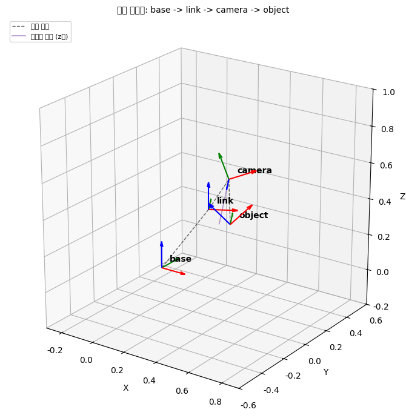
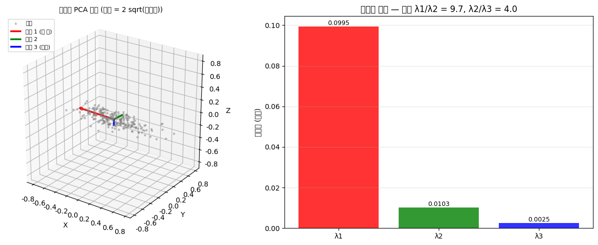
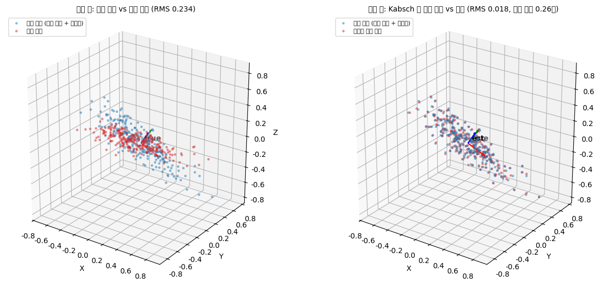
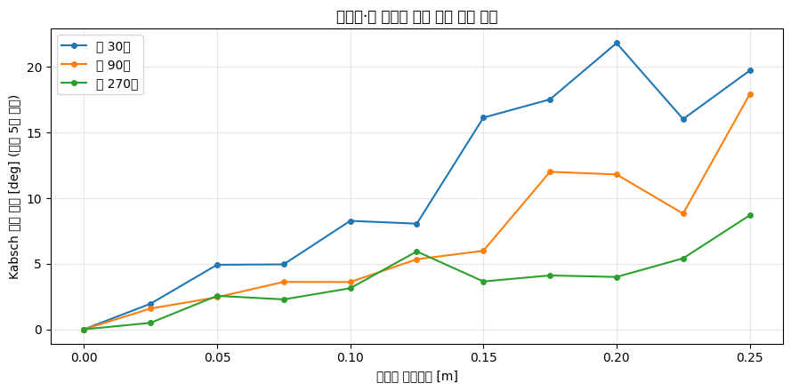

# 모듈 4 발표 자료 — 픽앤플레이스 자세 추정과 궤적 생성

> 이름: `정수용` / 제출일: `2026-09-11 금요일`

---

## 1. 파이프라인 전체 구조

- 좌표계 체인 (base -> link -> camera -> object) 그림 또는 다이어그램:

  

  base(원점) → link(관절, z축 30도 회전, 병진 [0.30, 0.00, 0.40]) → camera(y축 -20도 + x축 90도, 병진 [0.10, 0.05, 0.15]) → object(z축 25도 + x축 -90도, 카메라 앞 60cm). 각 변환은 4x4 동차변환 행렬로 표현되며 체인 곱 T_base_obj = T_base_link @ T_link_cam @ T_cam_obj 으로 조립된다.

- 각 노트북·모듈이 맡는 역할 (01 파이프라인 / 02 보간 / 03 자세 추정·시연):
  - **01_pipeline**: 장면 좌표계 정의(base·link·camera·object), `PosePipeline` 구현으로 카메라 점군을 base로 변환 및 왕복 검증, 관절 각도 변화에 따른 좌표 변화 확인, pytest 작성
  - **02_interpolation**: 쿼터니언 변환(행렬↔쿼터니언)과 SLERP 구현, 선형 보간 vs 큐빅 스플라인 vs 5차 다항식 궤적 비교, 연속성(C0/C2) 평가
  - **03_pose_estimation**: PCA 주축 추출, Kabsch 회전 추정, 노이즈·점 개수별 오차 분석, 이상치 제거(최소제곱 평면 피팅), SLERP+스플라인 궤적 애니메이션 시연

- 데이터 흐름: 카메라 점군 -> `PosePipeline` -> base 점군 -> PCA/Kabsch -> 목표 자세 -> SLERP + 스플라인 -> 애니메이션

- 모듈 3에서 가져온 함수와 이번에 새로 만든 함수 구분:
  - **모듈 3에서 가져온 함수**: `rot_x`, `rot_y`, `rot_z`, `rodrigues`, `axis_angle_from_matrix` (rotation.py), `make_T`, `inv_T`, `transform_points` (transform.py), `CoordinateChain`, `default_chain` (coordinate_chain.py)
  - **모듈 4에서 새로 만든 함수**: `PosePipeline` (pose_pipeline.py), `matrix_to_quaternion`, `quaternion_to_matrix`, `slerp`, `lerp_quat` (quaternion.py), `linear_interp`, `cubic_spline_interp`, `quintic_profile`, `finite_diff` (trajectory.py), `pca_axes`, `kabsch`, `rotation_angle_deg`, `fit_plane_lstsq`, `remove_outliers` (pose_estimation.py)

## 2. 자세 추정 결과와 오차

- PCA 주축 3개와 고유값:
  - 주축 1 (긴 축): [-0.999, 0.037, -0.009] — 고유값 λ1 = 0.0995 (√λ1 = 0.315, 생성 std 0.35)
  - 주축 2: [0.037, 0.999, -0.031] — 고유값 λ2 = 0.0103 (√λ2 = 0.101, 생성 std 0.10)
  - 주축 3 (법선): [0.008, -0.031, -0.999] — 고유값 λ3 = 0.0025 (√λ3 = 0.050, 생성 std 0.05)

  

- Kabsch 로 추정한 회전과 참값 사이 각도 오차: 0.2582도, 병진 오차: 0.000087 m
- 이상치 제거 전후 오차: 2.4158도 -> 0.1846도 (이상치 12개 제거, 검출률 100%)
- 정합 전후 그림 (03 노트북 캡처):

  

## 3. 노이즈·점 개수가 정확도에 미친 영향

- 노이즈 0 ~ 0.25 스윕에서 오차가 어떻게 커졌는가: 노이즈 0에서는 오차가 0에 가깝고 노이즈 표준편차가 커질수록 Kabsch 각도 오차가 단조 증가한다. 0.25에서는 30개 점군 기준 약 20도까지 오차가 커졌다.

- 점 개수 30 / 90 / 270 계열 비교 — 점이 많을수록 오차가 줄어드는 정도 (대략 몇 배): 고노이즈 구간(0.20~0.25)에서 30개 대비 270개가 약 2~3배 정확하다. 이는 평균 과정에서 각 점의 독립적인 노이즈가 1/√N 비율로 상쇄되기 때문이다. 30→270은 9배 증가이므로 노이즈 영향이 √9 = 3배 감소한다.

- 구형 점군에서 PCA 주축이 불안정해진 이유 (고유값 관점): 구형 점군(std 0.20/0.19/0.18)은 세 방향의 분산이 거의 같아 λ1 ≈ λ2 ≈ λ3 (비율 λ1/λ2 = 1.19)이 된다. 고유값이 중복에 가까우면 고유공간이 2차원 이상이 되어 주축 방향이 유일하게 결정되지 않는다. 실험 결과 길쭉한 점군의 주축 흔들림은 2.48도인 반면, 구형 점군은 72.73도로 불안정했다.

- 오차 그래프 (03 노트북 캡처):

  

## 4. 현재 구현의 한계

- 자세 추정: Kabsch 알고리즘은 점 대응(correspondence)이 알려진 경우에만 동작한다. 실제 환경에서는 어떤 점이 어떤 점에 대응하는지 알 수 없으므로 ICP 등 추가 알고리즘이 필요하다. 또한 PCA 주축은 대칭 물체에서 부호가 모호하고(180도 회전 구분 불가) 구형에 가까운 물체에서는 주축 자체가 불안정하다.

- 궤적 생성: 충돌 검사가 없어 경유점 사이에서 장애물과 충돌할 수 있다. 관절 각도·속도·가속도·토크 한계가 반영되지 않아 실제 로봇이 추종할 수 없는 궤적이 생성될 수 있다. 또한 경유점을 수동으로 정해야 하며 최적 경로를 자동 계산하지 않는다.

- 파이프라인: 관절이 1개(z축 회전)로 단순화되어 있어 실제 6축 로봇 팔의 복잡한 기구학을 반영하지 못한다. 카메라 캘리브레이션 오차(내부·외부 파라미터)가 무시되어 있고 센서 노이즈 모델이 등방성 가우시안으로 단순화되어 있다.

- 시연: 정적 점군에 대한 일회성 추정이며 실시간 추적이나 움직이는 물체 대응이 없다. 그리퍼 개폐 동작이 없고 물체를 실제로 잡거나 놓는 시퀀스가 구현되어 있지 않다.

## 5. 개선한다면 무엇을 어떻게

- ICP(Iterative Closest Point) 도입 -> 대응이 알려지지 않은 점군에 대해 가장 가까운 점을 반복적으로 매칭하고 정합하여 Kabsch의 대응 필요 제약을 해결한다.
- RANSAC 평면 피팅 -> 현재 최소제곱 피팅은 이상치에 민감하므로 무작위 샘플로 평면을 피팅하고 합의 집합을 구해 이상치에 강건한 평면 추정을 수행한다.
- 최소 저크(minimum jerk) 궤적 -> 5차 다항식의 양끝 조건에 더해 중간 구간에서도 저크(가속도의 미분)를 최소화하여 모터에 가해지는 충격을 줄이고 더 자연스러운 움직임을 만든다.
- 개선 효과를 어떻게 측정할 것인지: ICP는 대응 없는 점군에서의 Kabsch 각도 오차(현재는 측정 불가 → 0 이하 목표), RANSAC은 이상치 비율 20% 이상에서의 오차 감소율(현재 3σ 제거 대비 개선폭), 최소 저크는 가속도 점프 지표(jump(a))의 감소 비율로 각각 정량 평가한다.

---

### 부록 — 재현 정보

- Python / 주요 패키지 버전 (`requirements.txt`): Python 3.10.12 / numpy 2.2.6 / scipy 1.15.3 / matplotlib 3.10.9 / pytest 9.1.1 / Pillow 12.3.0 / jupyterlab 4.6.3 / ipykernel 7.3.0
- 난수 시드: `np.random.default_rng(42)`
- 세 노트북 Restart Kernel and Run All 통과 여부: 01_pipeline 통과, 02_interpolation 통과, 03_pose_estimation 문제 6-1 이후 셀(애니메이션) 미실행 상태 (T_frames NameError — 해당 셀 실행 필요)
- `demo.gif` 프레임 수: 60
